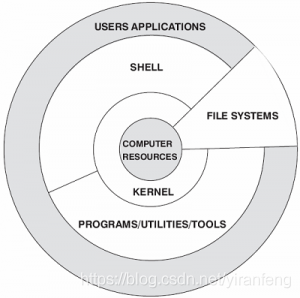
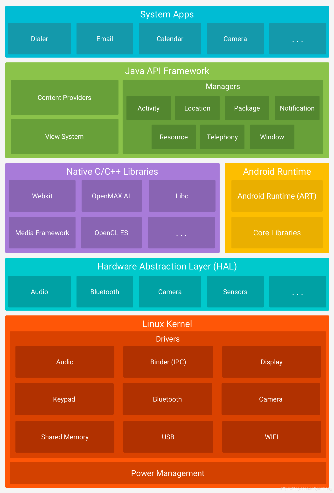

# 系统架构

***Android使用Linux内核(Marco Kernel)***

## 1. Linux系统架构
### 1.1 架构图

* Computer Resource: 硬件资源
* Kernel: 内核
* Shell: shell是系统的用户界面, 提供了用户与内核进行交互操作的一种接口. 它接受用户输入的命令并把它送入内核去执行, 是一个命令解释器
* Programs/Utilities/Tools: 库函数, 工具等
* File Systems: 文件系统是文件存放在磁盘等存储设备上的组织方法. 
* User Application: Linux应用(文本编辑器, XWindow, Internet工具, 数据库等)

### 1.2 Linux简介
1. Linux系统一般由4个组成部分: 内核Kernel, shell, 文件系统和应用程序. 内核, shell和文件系统一起组成了基本的操作系统结构, 它们让用户可以管理文件, 运行程序并使用系统.
2. Linux开机后, 内核启动, 激活内核空间, 抽象硬件, 初始化硬件参数等, 运行并维护虚拟内存, 调度器, 信号及进程间通讯(IPC)
3. 内核启动后, 再加载shell和用户应用程序, 用户应用程序使用C/C++编写, 被编译成机器码, 形成一个进程, 通过系统调用(Syscall)与内核系统进行联通. 进程间交流需要使用特殊的进程间通讯(IPC)机制

## 2. Android系统架构
***Android的系统非常复杂和庞大, 底层以Linux内核为基础, 上层采用带有虚拟机的Java层, 通过JNI技术, 将上下层打通.***
### 2.1 架构图

**Android从上到下依次为应用层(System App), 应用框架层(Java API Framework), 运行层(系统Native库和Android运行时环境), 硬件抽象层(HAL), Linux内核(Marco Kernel). 每一层都有对应的进程, 系统库**
1. 应用层(System Apps)
    * 该层中包含所有的Android应用程序, 包括电话, 相机, 日历等. 我们自己开发的Android应用程序也被安装在这层. 大部应用使用Java/Kotlin开发.
2. 应用框架层(Java API Framework)
    * 这一层主要提供构建应用程序可能用到的各种API, Android自带的一些核心应用就是使用这些API完成的, 开发者也可以使用API来构建自己的应用程序.
3. 运行层
    * 系统Native层
        * Android包含一些C/C++库, 这些库能被Android系统中不同的组件使用
    * Android运行时环境
        * Android包括了一个核心库, 该核心库提供了Java编程语言核心库的大多数功能. 虚拟机也在该层启动.
        * 每个Android应用都有一个专有的进程, 这些进程每个都有一个Dalivik虚拟机实例, 并在该实例中运行.
4. 硬件抽象层(HAL)
    * Android的硬件驱动与Linux不同, 传统的Linux内核驱动完全存在于内核空间中. 但是Android在内核外部增加了一个硬件抽象层(HAL Hardware Abstraction Layer), 把一部分硬件驱动放到了HAL层
    * 原因: Linux内核采用了GPL协议, 如果硬件厂商需要支持Linux系统, 就需要遵照GPL协议公开硬件驱动的源代码, 这势必会影响到硬件厂商的核心利益. Android的HAL层运行在用户空间, HAL是一个'空壳', Android会根据不同的需要, 加载不同的动态库. 这些动态库由硬件厂商提供. 硬件厂商把相关硬件功能写人动态库, 内核只开放一些基本的读写接口操作. 这样一些硬件厂商的驱动功能就由内核空间移动到了用户空间. Android的HAL层遵循Apache协议, 并不要求它的配套程序, 所以厂家提供的驱动库不需要进行开放, 保护了硬件厂商的核心利益.
5. Linux内核(Marco Kernel)
    * Android平台的基础是Linux内核, 比如ART虚拟机最终调用底层Linux内核来执行功能. Linux内核的安全机制为Android提供相应的保障, 也允许设备制造商为内核开发硬件驱动程序.

## 3. 参考
* [CSDN](https://blog.csdn.net/yiranfeng/article/details/103549149)