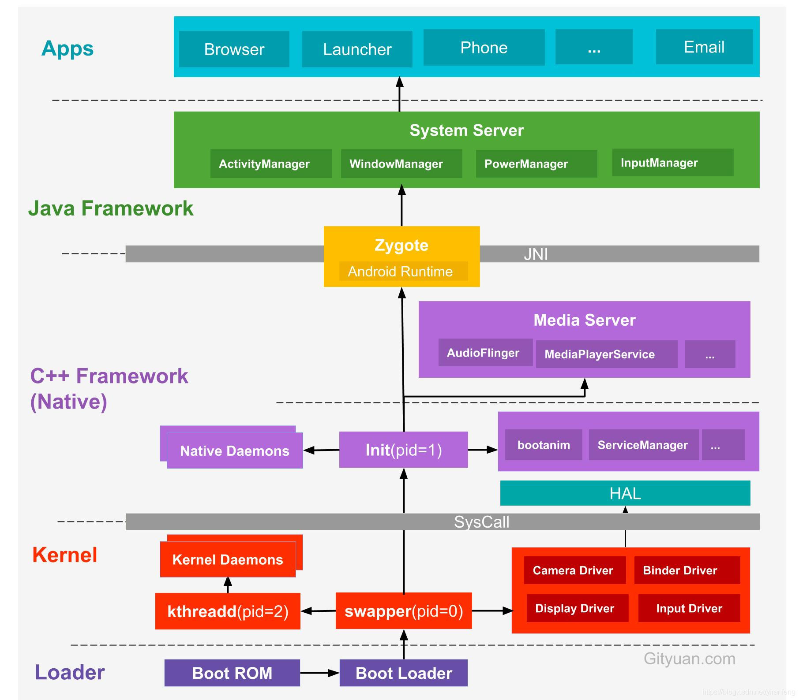

# Android启动过程

## 1. 概述
***流程: Boot Rom -> Bootloader -> Linux Kernel -> Init -> Zygote -> SystemServer -> Launcher***

* BootLoader层: 主要包括Boot Rom和Bootloader
* Kernel层: 主要是Android内核层
* Native层: 主要包括init进程以及其fork出的用户空间的守护进程, HAL层, 开机动画等
* Java Framework层: 主要是AMS和PMS等Service的初始化
* Application层: 主要指SystemUI, Launcher的启动

## 2. Android系统启动流程
1. 手机开机后, 引导芯片启动, 引导芯片开始从固化的ROM里的预设代码执行, 加载引导程序到RAM, Bootloader检查RAM, 初始化硬件参数等功能.
2. 硬件等参数初始化完成后, 进入到Kernel层, Kernel层主要加载一些硬件设备驱动, 初始化进程管理等操作. 在Kernel中首先启动swapper进程(pid=0), 用于初始化进程管理, 内存管理, 加载Driver等操作, 在启动kthread进程(pid=2), 这些Linux系统的内核进程, kthread是所有内核进程的鼻祖
3. Kernel层加载完毕后, 硬件设备驱动与HAL层进行交互.初始化进程管理等操作会启动init进程, 这些在Native层中.
4. init进程(pid=1, init进程是所有进程的鼻祖, 第一个启动)启动后, 会启动adbd, logd等用户守护进程, 并且会启动ServiceManager(Binder服务管家)等重要服务, 同时孵化出zygote进程, 这里属于C++ Framework, 代码为C++程序.
5. zygote进程是由init进程解析init.rc文件后fork生成的, 它会加载虚拟机, 启动System Server(zygote孵化的第一个进程). System Server负责启动和管理整个Java Framework, 包含ActivityManager, WindowManager, Package Manager, PowerManager等服务.
6. zygote同时会启动相关的APP进程, 它启动的第一个APP进程为Launcher, 然后启动Email, SMS等进程. 所有的APP进程都有zygote fork生成.

## 3. 参考
* [CSDN](https://blog.csdn.net/yiranfeng/article/details/103549290)