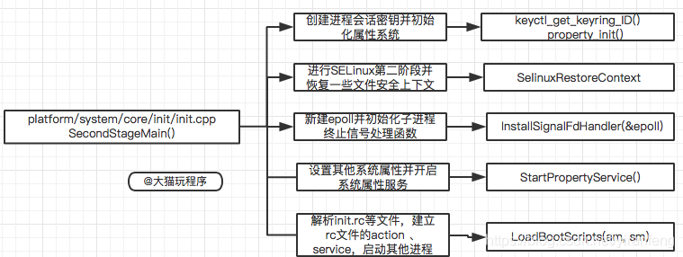

# init进程
***init进程是Linux系统中用户空间的第一个进程, 进程号为1. 当Bootloader启动后, 启动Kernel, Kernel启动完成后, 在用户空间启动init进程, 再通过init进程, 来读取init.rc中的相关配置, 从而来启动其他相关进程以及其他操作.***

**Android init启动进程主要分三个阶段**
1. init被启动
2. init进程启动的源码
3. rc语法分析

## 1. 概览
**init进程是Linux系统中用户空间的第一个进程, 进程号为1.**  
**当Bootloader启动后, 启动Kernel, Kernel启动完成后, 在用户空间启动init进程, 在通过init进程, 来读取init.rc中的相关配置, 从而来启动其他相关进程以及其他操作.**
**init进程被赋予了很多重要工作, init进程启动主要分为两个阶段:**
1. 第一个阶段完成以下内容:
    * ueventd/watchdogd跳转及环境变量设置
    * 挂载文件系统并创建目录
    * 初始化日志输出, 挂载分区设备
    * 启用SELinux安全策略
    * 开始第二阶段前的准备
2. 第二阶段完成以下内容:
    * 初始化属性系统
    * 执行SELinux第二阶段并恢复一些文件安全上下文
    * 新建epoll并初始化子进程终止信号处理函数
    * 设置其他系统属性并开启属性服务
## 2. 架构
###  2.1. init进程启动过程

* init进程是在Kernel启动后, 启动的第一个用户进程, PID是1
* kernel_init启动后, 完成一些init的初始化操作, 然后去系统根目录下依次找ramdisk_execute_command和execute_command设置的应用程序, 如果这两个目录都找不到, 就依次去根目录找/sbin/init, /etc/init, /bin/init, /bin/sh这四个应用程序进行启动, 只要这些应用程序有一个启动了, 其他就不启动了.
* Android系统一般会在根,目录下方一个init的可执行文件, 也就是说Linux系统的init进程在内核初始化完成后, 就直接执行init文件.

### 2.2. init进程启动后的操作

* init进程启动后, 首先挂载文件系统, 再挂载相应的分区, 启动SELinux安全策略, 启动属性服务, 解析rc文件, 并启动相应属性服务进程, 初始化epoll, 以此设置signal, property, keychord这三个fd可读时相应的回调函数. 进入无限循环, 用来响应各个进程的变化与重建.

## 3. Kernel启动init进程流程
1. kernel_init
    ```cpp
        static int __ref kernel_init(void *unused)
        {
            int ret;
            kernel_init_freeable(); // 进行init进程的一些初始化操作
            async_synchronize_full(); // 等待所有的异步调用执行完成, 在释放内存前, 必须完成所有的异步 __init代码
            ftrace_free_init_mem(); 
            free_initmem();// 释放所有init.*段中的代码
            mark_readonly();
            system_state = SYSTEM_RUNNING; // 设置系统状态为运行状态
            numa_default_policy(); // 设定NUMA系统的默认内存访问策略

            rcu_end_inkernel_boot();
        #ifdef CONFIG_MTPROF
                log_boot("Kernel_init_done");
        #endif
            if (ramdisk_execute_command) { // ramdisk_execute_command的值为"/init"
                ret = run_init_process(ramdisk_execute_command);
                if (!ret)
                    return 0;
                pr_err("Failed to execute %s (error %d)\n", ramdisk_execute_command, ret);
            }

            if (execute_command) {
                ret = run_init_process(execute_command); // execute_command的值如果有定义就去根目录下找对应的应用程序, 然后启动
                if (!ret)
                    return 0;
                panic("Requested init %s failed (error %d).", execute_command, ret);
            }
            if (!try_to_run_init_process("/sbin/init") || !try_to_run_init_process("/etc/init") || !try_to_run_init_process("/bin/init") || !try_to_run_init_process("/bin/sh"))//如果ramdisk_execute_command和execute_command定义的应用程序都没有找到, 就到根目录下找 /sbin/init, /etc/init, /bin/init, /bin/sh 这四个应用程序进行启动
                return 0;
            panic("No working init found.  Try passing init= option to kernel. See Linux Documentation/admin-guide/init.rst for guidance.");
        }
    ```

2. do_basic_setup(kernel_init -> kernel_init_freeable -> do_basic_setup)
    ```cpp
        static void __init do_basic_setup(void)
        {
            cpuset_init_smp(); // 针对SMP系统, 初始化内核control group的cpuset子系统
            shmem_init(); // 初始化共享内存
            driver_init(); // 初始化设备驱动
            init_irq_proc(); // 创建/proc/irq目录, 并初始化系统中所有中断对应的子目录
            do_ctors(); // 执行内核的构造函数
            usermodehelper_enable(); // 启用usermodelhelper
            do_initcalls(); // 遍历initcall_levels数组, 调用里面的initcall函数, 对设备, 驱动, 文件系统进行初始化(将函数封装到数组遍历, 目的是为了好扩展)
        }
    ```

## 4. init 进程启动源码分析
**init进程入口**
* kernel_init启动init进程, init进程属于一个守护进程, 它是Linux系统中用户控制的第一个进程, 它的进程号是1. 它的生命周期贯穿整个Linux内核运行的始终. Android中所有其它的进程共同的鼻祖均为init进程
* 可以通过`adb shell ps | grep init`的命令查看init的进程号
* 源码
    1. main.cpp
        ```cpp
        // main函数的参数, argc: 参数个数, argv: 参数列表
        // main函数有四个参数入口
        //     1. 参数中有ueventd: 进入ueventd_main
        //     2. 参数中有subcontext, 进入InitLogging和SubcontextMain
        //     3. 参数中有selinux_setup, 进入SetupSelinux
        //     4. 参数中有second_stage, 进入SecondStageMain
        // main的执行顺序如下
        //     1. ueventd_main  init进程创建子进程ueventd, 并将创建设备节点文件的工作托付给ueventd, ueventd通过两种方式创建设备节点文件
        //     2. FirstStageMain  启动第一阶段
        //     3. SetupMain  加载selinux规则, 并设置selinux日志, 完成SELinux相关工作
        //     4. SecondStageMain  启动第二阶段
        int main(int argc, char** argv) {
        #if __has_feature(address_sanitizer)
            __asan_set_error_report_callback(AsanReportCallback);
        #endif
            // 当argv[0]是ueventd时, 执行ueventd_main, ueventd主要负责设备节点的创建, 权限设定等一系列工作
            if (!strcmp(basename(argv[0]), "ueventd")) {
                return ueventd_main(argc, argv);
            }
            // 当传入的参数个数大于1时
            if (argc > 1) {
                // 参数是subcontext, 初始化日志系统
                if (!strcmp(argv[1], "subcontext")) {
                    android::base::InitLogging(argv, &      droid::base::KernelLogger);
                    const BuiltinFunctionMap& function_map =        tBuiltinFunctionMap();
                    return SubcontextMain(argc, argv, &function_map);
                }
                // 参数是selinux_setup时, 启动SELinux安全策略
                if (!strcmp(argv[1], "selinux_setup")) {
                    return SetupSelinux(argv);
                }
                // 参数是second_stage, 启动init进程第二阶段
                if (!strcmp(argv[1], "second_stage")) {
                    return SecondStageMain(argc, argv);
                }
            }
            // 默认启动init进程第一阶段
            return FirstStageMain(argc, argv);
        }
        ```
    2. ueventd_main
        * Android根文件系统的镜像中不存在/dev目录, 该目录是init进程启动后动态创建的, 所以建立Android中设备节点的任务也交给init进程. 为此, init进程创建子进程ueventd, 并将创建节点文件的工作交给ueventd.
        * ueventd通过两种方式创建设备节点文件
            1. 冷插拔(Cold Plug), 即可以预先定义的设备信息为基础, 当ueventd启动后, 统一创建设备节点文件. 这一类设备节点文件也被称为io静态节点文件
            2. 热插拔(Hot Plug), 即在系统运行中, 当有设备插入USB端口时, ueventd就会接收到这一事件, 为插入的设备动态创建设备节点文件, 这一类设备节点文件也被称为动态节点文件
        ```cpp
        int ueventd_main(int argc, char** argv) {
            // 设置新建文件的默认值, 这与chmod相反, 这里相当于新建文件后的权限是666
            umask(000);
            // 初始化内核日志, 位于节点/dev/kmsg, 此时logd, logcat进程还没有起来
            // 采用kernel的log系统, 打开设备节点/dev/kmsg, 那么可以通过cat /dev/kmsg来获取内核log
            android::base::InitLogging(argv, &android::base::KernelLogger);
            LOG(INFO) << "ueventd started!";
            // 注册selinux相关的打印log的回调函数
            SelinuxSetupKernelLogging();
            SelabelInitialize();
            std::vector<std::unique_ptr<UeventHandler>> uevent_handlers;
            auto hardware = android::base::GetProperty("ro.hardware", "");
            // 解析xml, 根据不同SoC厂商获取不同的hardware.rc
            auto ueventd_configuration = ParseConfig({"/system/etc/ueventd.rc", "/vendor/ueventd.rc", "/odm/ueventd.rc", "/ueventd." + hardware + ".rc"});
            uevent_handlers.emplace_back(std::make_unique<DeviceHandler>(std::move(ueventd_configuration.dev_permissions), std::move(ueventd_configuration.sysfs_permissions), std::move(ueventd_configuration.subsystems), android::fs_mgr::GetBootDevices(), true));
            uevent_handlers.emplace_back(std::make_unique<FirmwareHandler>(std::move(ueventd_configuration.firmware_directories), std::move(ueventd_configuration.external_firmware_handlers)));
            if (ueventd_configuration.enable_modalias_handling) {
                std::vector<std::string> base_paths = {"/odm/lib/modules", "/vendor/lib/modules"};
                uevent_handlers.emplace_back(std::make_unique<ModaliasHandler>(base_paths));
            }
            UeventListener uevent_listener(ueventd_configuration.uevent_socket_rcvbuf_size);
            // 冷启动
            if (!android::base::GetBoolProperty(kColdBootDoneProp, false)) {
                ColdBoot cold_boot(uevent_listener, uevent_handlers, ueventd_configuration.enable_parallel_restorecon);
                cold_boot.Run();
            }
            for (auto& uevent_handler : uevent_handlers) {
                uevent_handler->ColdbootDone();
            }
            // 忽略子进程终止信号
            signal(SIGCHLD, SIG_IGN);
            //获取和挂起在最后一次waitpid()调用与为上面的SIGCHLD设置SIG_IGN之间退出的子节点。
            while (waitpid(-1, nullptr, WNOHANG) > 0) {
            }
            // 监听来自驱动的uevent 进行热插拔处理
            uevent_listener.Poll([&uevent_handlers](const Uevent& uevent) {
                for (auto& uevent_handler : uevent_handlers) {
                    uevent_handler->HandleUevent(uevent);
                }
                return ListenerAction::kContinue;
            });
            return 0;
        }
        ```
    3. init进程启动第一阶段(FirstStageMain)
        * init进程第一阶段做的主要工作是挂载分区, 创建设备节点和一些关键目录, 初始化日志输出系统, 启用SELinux安全策略
        * 第一阶段完成以下内容
            1. 创建文件系统目录并挂载相关的文件系统
            2. 屏蔽标准的输入输出/初始化内核log系统
        ```cpp
        int FirstStageMain(int argc, char** argv) {
            // init crash时 重启引导加载程序
            // 这个函数主要作用是 将各种信号量如SIGABRT, SIGBUS等的行为设置为SA_RESTART, 一旦监听到这些信号,即执行重启系统
            if (REBOOT_BOOTLOADER_ON_PANIC) {
                InstallRebootSignalHandlers();
            }
            boot_clock::time_point start_time = boot_clock::now();
            std::vector<std::pair<std::string, int>> errors;
        #define CHECKCALL(x) \
            if ((x) != 0) errors.emplace_back(#x " failed", errno);
            // 清空文件权限
            umask(0);
            CHECKCALL(clearenv());
            CHECKCALL(setenv("PATH", _PATH_DEFPATH, 1));
            // 在RAM上获取最基本的文件系统, 剩余的被rc文件所用
            CHECKCALL(mount("tmpfs", "/dev", "tmpfs", MS_NOSUID, "mode=0755"));
            CHECKCALL(mkdir("/dev/pts", 0755));
            CHECKCALL(mkdir("/dev/socket", 0755));
            CHECKCALL(mount("devpts", "/dev/pts", "devpts", 0, NULL));
        #define MAKE_STR(x) __STRING(x)
            CHECKCALL(mount("proc", "/proc", "proc", 0, "hidepid=2,gid=" MAKE_STR(AID_READPROC)));
        #undef MAKE_STR
            // 非特权应用不能使用Android cmdline
            CHECKCALL(chmod("/proc/cmdline", 0440));
            std::string cmdline;
            android::base::ReadFileToString("/proc/cmdline", &cmdline);
            gid_t groups[] = {AID_READPROC};
            CHECKCALL(setgroups(arraysize(groups), groups));
            CHECKCALL(mount("sysfs", "/sys", "sysfs", 0, NULL));
            CHECKCALL(mount("selinuxfs", "/sys/fs/selinux", "selinuxfs", 0, NULL));
            CHECKCALL(mknod("/dev/kmsg", S_IFCHR | 0600, makedev(1, 11)));
            if constexpr (WORLD_WRITABLE_KMSG) {
                CHECKCALL(mknod("/dev/kmsg_debug", S_IFCHR | 0622, makedev(1, 11)));
            }
            CHECKCALL(mknod("/dev/random", S_IFCHR | 0666, makedev(1, 8)));
            CHECKCALL(mknod("/dev/urandom", S_IFCHR | 0666, makedev(1, 9)));
            // 它在ueventd运行之前调用, 这对日志包装器是必需的
            CHECKCALL(mknod("/dev/ptmx", S_IFCHR | 0666, makedev(5, 2)));
            CHECKCALL(mknod("/dev/null", S_IFCHR | 0666, makedev(1, 3)));
            // 在第一阶段挂在tmpfs, mnt/vendor, mount/product分区, 其他分区不需要在第一阶段加载, 只需要在第二阶段通过rc文件解析来加载
            CHECKCALL(mount("tmpfs", "/mnt", "tmpfs", MS_NOEXEC | MS_NOSUID | MS_NODEV, "mode=0755,uid=0,gid=1000"));
            // 提供可供读写的vendor
            CHECKCALL(mkdir("/mnt/vendor", 0755));
            CHECKCALL(mkdir("/mnt/product", 0755));
            CHECKCALL(mount("tmpfs", "/debug_ramdisk", "tmpfs", MS_NOEXEC | MS_NOSUID | MS_NODEV, "mode=0755,uid=0,gid=0"));
        #undef CHECKCALL
            // 把标准输入, 标准输出和标准错误重定向到空设备文件/dev/null
            SetStdioToDevNull(argv);
        #ifdef MTK_LOG
        #ifndef MTK_LOG_DISABLERATELIMIT
            if (cmdline.find("init.mtklogdrl=1") != std::string::npos)
                SetMTKLOGDISABLERATELIMIT();
        #else
            SetMTKLOGDISABLERATELIMIT();
        #endif 
            if (GetMTKLOGDISABLERATELIMIT())
                InitKernelLogging_split(argv);
            else
                InitKernelLogging(argv);
        #else
        // 在/dev目录下挂载好tmpfs和kmsg, 这样就可以初始化/kernel log系统 供用户打印log
            InitKernelLogging(argv);
        #endif
            if (!errors.empty()) {
                for (const auto& [error_string, error_errno] : errors) {
                    LOG(ERROR) << error_string << " " << strerror(error_errno);
                }
                LOG(FATAL) << "Init encountered errors starting first stage, aborting";
            }
            LOG(INFO) << "init first stage started!";
            auto old_root_dir = std::unique_ptr<DIR, decltype(&closedir)>{opendir("/"), closedir};
            if (!old_root_dir) {
                PLOG(ERROR) << "Could not opendir(\"/\"), not freeing ramdisk";
            }
            struct stat old_root_info;
            if (stat("/", &old_root_info) != 0) {
                PLOG(ERROR) << "Could not stat(\"/\"), not freeing ramdisk";
                old_root_dir.reset();
            }
            auto want_console = ALLOW_FIRST_STAGE_CONSOLE ? FirstStageConsole(cmdline) : 0;
        #ifdef MTK_LOG
            android::base::Timer t;
            LOG(INFO) << "LoadKernelModules starting!";
        #endif
            if (!LoadKernelModules(IsRecoveryMode() && !ForceNormalBoot(cmdline), want_console)) {
                if (want_console != FirstStageConsoleParam::DISABLED) {
                    LOG(ERROR) << "Failed to load kernel modules, starting console";
                } else {
                    LOG(FATAL) << "Failed to load kernel modules";
                }
            }
        #ifdef MTK_LOG
            LOG(INFO) << "LoadKernelModules exited! It took " << t.duration().count() << "ms.";
        #endif
            if (want_console == FirstStageConsoleParam::CONSOLE_ON_FAILURE) {
                StartConsole();
            }
            if (ForceNormalBoot(cmdline)) {
                mkdir("/first_stage_ramdisk", 0755);
                if (mount("/first_stage_ramdisk", "/first_stage_ramdisk", nullptr, MS_BIND, nullptr) != 0) {
                    LOG(FATAL) << "Could not bind mount /first_stage_ramdisk to itself";
                }
                SwitchRoot("/first_stage_ramdisk");
            }
            if (access("/force_debuggable", F_OK) == 0) {
                std::error_code ec; 
                if (!fs::copy_file("/adb_debug.prop", kDebugRamdiskProp, ec) ||
                    !fs::copy_file("/userdebug_plat_sepolicy.cil", kDebugRamdiskSEPolicy, ec)) {
                    LOG(ERROR) << "Failed to setup debug ramdisk";
                } else {
                    setenv("INIT_FORCE_DEBUGGABLE", "true", 1);
        #ifdef MTK_LOG
                    LOG(INFO) << "setenv (INIT_FORCE_DEBUGGABLE,true) for second-stage init to read above kDebugRamdisk* files";
        #endif
                }
            }
            // 初始化一些必须的分区, 主要作用是去解析/proc/device-tree/firmaware/android/fstab, 然后得到/system, /vendor, /odm三个目录的挂载信息
            if (!DoFirstStageMount()) {
                LOG(FATAL) << "Failed to mount required partitions early ...";
            }
            struct stat new_root_info;
            if (stat("/", &new_root_info) != 0) {
                PLOG(ERROR) << "Could not stat(\"/\"), not freeing ramdisk";
                old_root_dir.reset();
            }
            if (old_root_dir && old_root_info.st_dev != new_root_info.st_dev) {
                FreeRamdisk(old_root_dir.get(), old_root_info.st_dev);
            }
            SetInitAvbVersionInRecovery();
            setenv(kEnvFirstStageStartedAt, std::to_string(start_time.time_since_epoch().count()).c_str(), 1);
            // 启动init进程, 传入参数selinux_setup, 执行命令/system/bin/init selinux_setup
            const char* path = "/system/bin/init";
            const char* args[] = {path, "selinux_setup", nullptr};
            auto fd = open("/dev/kmsg", O_WRONLY | O_CLOEXEC);
            dup2(fd, STDOUT_FILENO);
            dup2(fd, STDERR_FILENO);
            close(fd);
            execv(path, const_cast<char**>(args));
            PLOG(FATAL) << "execv(\"" << path << "\") failed";
            return 1;
        }
        ```
    4. 加载SELinux规则
        * SELinux是Security-Enanced Linux的简称, 是美国国家安全局NSA(The National Security Agency)和SCC(Secure Computing Corporation)开发的Linux的一个扩张强制访问控制安全模块, 在这种访问控制体系的限制下, 进程只能访问那些在它的任务中所需文件.
        * SELinux有两种工作模式
            1. permissive: 所有的操作都被允许(即没有MAC), 但是如果违反权限的话, 会记录日志, 一般eng模式用
            2. enforcing, 所有操作都会进行权限检查, 一般user和user-debug模式用
        * 不管是security_setenforce还是security_getenforce都是去操作/sys/fs/selinux/enforce文件, 0表示permissive, 1表示enforcing
        1. SetUpSeLinux: 初始化SELinux, 加载SELinux规则, 配置SELinux相关log输出, 并启动第二阶段
            ```cpp
            int SetupSelinux(char** argv) {
                SetStdioToDevNull(argv);
            #ifdef MTK_LOG
            #ifndef MTK_LOG_DISABLERATELIMIT
                {
                    std::string cmdline;
                    android::base::ReadFileToString("/proc/cmdline", &cmdline);
                    if (cmdline.find("init.mtklogdebuggable=1") != std::string::npos)
                        SetMTKLOGDISABLERATELIMIT();
                }
            #else
                SetMTKLOGDISABLERATELIMIT();
            #endif
                if (GetMTKLOGDISABLERATELIMIT())
                    InitKernelLogging_split(argv);
                else
                    InitKernelLogging(argv);
            #else
                // 初始化Kernel日志
                InitKernelLogging(argv);
            #endif
                // Debug版本init crash时重启引导加载程序
                if (REBOOT_BOOTLOADER_ON_PANIC) {
                    InstallRebootSignalHandlers();
                }
                boot_clock::time_point start_time = boot_clock::now();
                MountMissingSystemPartitions();
            #ifdef MTK_LOG
                if (GetMTKLOGDISABLERATELIMIT())
                    SelinuxSetupKernelLogging_split();
                else
                    SelinuxSetupKernelLogging();
            #else
                // 注册回调, 用来设置需要写入kmsg的SELinux日志
                SelinuxSetupKernelLogging();
            #endif
                // 加载SELinux规则
                SelinuxInitialize();
                // 在内核域中, 希望转换到init域. 在其xattrs中储存selabel的文件系统(如 ext4) 不需要显式restorecon, 但其他文件系统需要. 尤其是对于ramdisk, 如对于a/b设备的恢复映像, 这是必需要做的一步. 其实就是在当前在内核域中, 在加载SELinux后, 需要重新执行init切换到C空间的用户态
                if (selinux_android_restorecon("/system/bin/init", 0) == -1) {
                    PLOG(FATAL) << "restorecon failed of /system/bin/init failed";
                }
                setenv(kEnvSelinuxStartedAt, std::to_string(start_time.time_since_epoch().count()).c_str(), 1);
                // 准备启动init进程, 传入参数second_stage
                const char* path = "/system/bin/init";
                const char* args[] = {path, "second_stage", nullptr};
                execv(path, const_cast<char**>(args));
                // 执行/system/bin/init second_stage 进入第二阶段
                PLOG(FATAL) << "execv(\"" << path << "\") failed";
                return 1;
            }
            ```
        2. SelinuxInitialize
            ```cpp
            // 加载SELinux规则
            void SelinuxInitialize() {
                LOG(INFO) << "Loading SELinux policy";
                if (!LoadPolicy()) {
                    LOG(FATAL) << "Unable to load SELinux policy";
                }
                // 获取当前Kernel的工作模式
                bool kernel_enforcing = (security_getenforce() == 1);
                // 获取工作模式的配置
                bool is_enforcing = IsEnforcing();
                // 如果当其的工作模式与配置的不同, 就将当前的工作模式改掉
                if (kernel_enforcing != is_enforcing) {
                    if (security_setenforce(is_enforcing)) {
                        PLOG(FATAL) << "security_setenforce(" << (is_enforcing ? "true" : "false")
                                    << ") failed";
                    }
                }
                if (auto result = WriteFile("/sys/fs/selinux/checkreqprot", "0"); !result.ok()) {
                    LOG(FATAL) << "Unable to write to /sys/fs/selinux/checkreqprot: " << result.error();
                }
            }
            ```
        3. LoadPolicy
            ```cpp
            // 加载SELinux规则, 这里区分了两种情况, 这两种情况只是区分从哪里加载安全策略文件
            //      1. 从/vendor/etc/selinux/precompiled_sepolicy读取
            //      2. 从/sepolicy读取, 它们最终都是调用selinux_android_load_policy_from_fd方法
            bool LoadPolicy() {
                return IsSplitPolicyDevice() ? LoadSplitPolicy() : LoadMonolithicPolicy();
            }
            ```
    5. init进程启动第二阶段
        * 创建进程会话密钥并初始化属性系统
        * 进行SELinux第二阶段并恢复一些文件安全上下文
        * 新建epoll并初始化子进程终止信号处理函数
        * 启动匹配属性的服务端
        * 解析init.rc等文件, 建立rc文件的action, service, 启动其他进程
        
        * **SecondStageMain**
            ```cpp
            int SecondStageMain(int argc, char** argv) {
                // init crash时重启引导加载程序, 这个函数主要作用 将各种信号量, 如SIGABRT, SIGBUS等行为设置为SA_RESTART, 一旦监听到这些信号即执行重启系统
                if (REBOOT_BOOTLOADER_ON_PANIC) {
                    InstallRebootSignalHandlers();
                }
                boot_clock::time_point start_time = boot_clock::now();
                trigger_shutdown = [](const std::string& command) { shutdown_state.TriggerShutdown(command); };
                // 把stdio重定向到/dev/null
                SetStdioToDevNull(argv);
            #ifdef MTK_LOG
            #ifndef MTK_LOG_DISABLERATELIMIT
                {
                    std::string cmdline;
                    android::base::ReadFileToString("/proc/cmdline", &cmdline);
                    if (cmdline.find("init.mtklogdrl=1") != std::string::npos)
                        SetMTKLOGDISABLERATELIMIT();

                    const char* force_debuggable_env = getenv("INIT_FORCE_DEBUGGABLE");
                    if (force_debuggable_env && AvbHandle::IsDeviceUnlocked()) {
                        SetMTKLOGDISABLERATELIMIT();
                    }
                }
            #else
                SetMTKLOGDISABLERATELIMIT();
            #endif

                if (GetMTKLOGDISABLERATELIMIT())
                    InitKernelLogging_split(argv);
                else
                    InitKernelLogging(argv);
            #else
                // 在/dev目录下挂载好tmpfs以及kmsg, 初始化/kernel Log系统, 供用户打印log
                InitKernelLogging(argv);
            #endif
                LOG(INFO) << "init second stage started!";
                {
                    struct sigaction action = {.sa_flags = SA_RESTART};
                    action.sa_handler = [](int) {};
                    sigaction(SIGPIPE, &action, nullptr);
                }
                if (auto result = WriteFile("/proc/1/oom_score_adj", StringPrintf("%d", DEFAULT_OOM_SCORE_ADJUST)); !result.ok()) {
                    LOG(ERROR) << "Unable to write " << DEFAULT_OOM_SCORE_ADJUST  << " to /proc/1/oom_score_adj: " << result.error();
                }
                // 创建进程会话密钥并初始化属性系统
                keyctl_get_keyring_ID(KEY_SPEC_SESSION_KEYRING, 1);
                //  创建/dev/.booting文件, 这是个标记, 表示booting进行中
                close(open("/dev/.booting", O_WRONLY | O_CREAT | O_CLOEXEC, 0000));
                const char* force_debuggable_env = getenv("INIT_FORCE_DEBUGGABLE");
                bool load_debug_prop = false;
                if (force_debuggable_env && AvbHandle::IsDeviceUnlocked()) {
                    load_debug_prop = "true"s == force_debuggable_env;
                }
                unsetenv("INIT_FORCE_DEBUGGABLE");
                if (!load_debug_prop) {
                    UmountDebugRamdisk();
                }
                // 初始化属性系统, 并指定文件读取属性
                PropertyInit();
                if (load_debug_prop) {
                    UmountDebugRamdisk();
                }
                MountExtraFilesystems();
            #ifdef MTK_LOG
                if (GetMTKLOGDISABLERATELIMIT())
                    SelinuxSetupKernelLogging_split();
                else
                    SelinuxSetupKernelLogging();
            #else
                SelinuxSetupKernelLogging();
            #endif
                SelabelInitialize();
                // 进行SELinux第二阶段并恢复一些文件安全上下文
                SelinuxRestoreContext();
                // 新建epoll并初始化子进程处理终止信号处理函数
                Epoll epoll;
                if (auto result = epoll.Open(); !result.ok()) {
                    PLOG(FATAL) << result.error();
                }
            #ifdef G1122717
                LOG(INFO) << "Apply watching properties with specific meanings to init.";
                ActionManager::GetInstance().StartWatchingProperty("sys.powerctl");
                ActionManager::GetInstance().StartWatchingProperty("ro.persistent_properties.ready");
                ActionManager::GetInstance().StartWatchingProperty(kColdBootDoneProp);
            #endif
                InstallSignalFdHandler(&epoll);
                InstallInitNotifier(&epoll);
                // 设置其他系统属性并开启系统属性服务
                StartPropertyService(&property_fd);
                RecordStageBoottimes(start_time);
                if (const char* avb_version = getenv("INIT_AVB_VERSION"); avb_version != nullptr) {
                    SetProperty("ro.boot.avb_version", avb_version);
                }
                unsetenv("INIT_AVB_VERSION");
                fs_mgr_vendor_overlay_mount_all();
                export_oem_lock_status();
                MountHandler mount_handler(&epoll);
                SetUsbController();
                const BuiltinFunctionMap& function_map = GetBuiltinFunctionMap();
                Action::set_function_map(&function_map);
                if (!SetupMountNamespaces()) {
                    PLOG(FATAL) << "SetupMountNamespaces failed";
                }
                InitializeSubcontext();
                // 解析init.rc等文件, 建立rc文件的action, service 启动其他进程
                ActionManager& am = ActionManager::GetInstance();
                ServiceList& sm = ServiceList::GetInstance();
                LoadBootScripts(am, sm);
                if (false) DumpState();
                auto is_running = android::gsi::IsGsiRunning() ? "1" : "0";
                SetProperty(gsi::kGsiBootedProp, is_running);
                auto is_installed = android::gsi::IsGsiInstalled() ? "1" : "0";
                SetProperty(gsi::kGsiInstalledProp, is_installed);
                am.QueueBuiltinAction(SetupCgroupsAction, "SetupCgroups");
                am.QueueBuiltinAction(SetKptrRestrictAction, "SetKptrRestrict");
                am.QueueBuiltinAction(TestPerfEventSelinuxAction, "TestPerfEventSelinux");
                am.QueueEventTrigger("early-init");
                am.QueueBuiltinAction(wait_for_coldboot_done_action, "wait_for_coldboot_done");
                am.QueueBuiltinAction(MixHwrngIntoLinuxRngAction, "MixHwrngIntoLinuxRng");
                am.QueueBuiltinAction(SetMmapRndBitsAction, "SetMmapRndBits");
                Keychords keychords;
                am.QueueBuiltinAction(
                        [&epoll, &keychords](const BuiltinArguments& args) -> Result<void> {
                            for (const auto& svc : ServiceList::GetInstance()) {
                                keychords.Register(svc->keycodes());
                            }
                            keychords.Start(&epoll, HandleKeychord);
                            return {};
                        },
                        "KeychordInit");
                am.QueueEventTrigger("init");
                am.QueueBuiltinAction(MixHwrngIntoLinuxRngAction, "MixHwrngIntoLinuxRng");
                std::string bootmode = GetProperty("ro.bootmode", "");
                if (bootmode == "charger") {
                    am.QueueEventTrigger("charger");
                } else {
                    am.QueueEventTrigger("late-init");
                }
                am.QueueBuiltinAction(queue_property_triggers_action, "queue_property_triggers");
                while (true) {
                    auto epoll_timeout = std::optional<std::chrono::milliseconds>{};
                    auto shutdown_command = shutdown_state.CheckShutdown();
                    if (shutdown_command) {
                        HandlePowerctlMessage(*shutdown_command);
                    }
                    if (!(prop_waiter_state.MightBeWaiting() || Service::is_exec_service_running())) {
                        am.ExecuteOneCommand();
                    }
                    if (!IsShuttingDown()) {
                        auto next_process_action_time = HandleProcessActions();
                        if (next_process_action_time) {
                            epoll_timeout = std::chrono::ceil<std::chrono::milliseconds>(
                                    *next_process_action_time - boot_clock::now());
                            if (*epoll_timeout < 0ms) epoll_timeout = 0ms;
                        }
                    }
                    if (!(prop_waiter_state.MightBeWaiting() || Service::is_exec_service_running())) {
                        if (am.HasMoreCommands()) epoll_timeout = 0ms;
                    }
            #ifdef MTK_LOGint SecondStageMain(int argc, char** argv) {
                if (REBOOT_BOOTLOADER_ON_PANIC) {
                    InstallRebootSignalHandlers();
                }
                boot_clock::time_point start_time = boot_clock::now();
                trigger_shutdown = [](const std::string& command) { shutdown_state.TriggerShutdown(command); };
                SetStdioToDevNull(argv);
            #ifdef MTK_LOG
            #ifndef MTK_LOG_DISABLERATELIMIT
                {
                    std::string cmdline;
                    android::base::ReadFileToString("/proc/cmdline", &cmdline);
                    if (cmdline.find("init.mtklogdrl=1") != std::string::npos)
                        SetMTKLOGDISABLERATELIMIT();
                    const char* force_debuggable_env = getenv("INIT_FORCE_DEBUGGABLE");
                    if (force_debuggable_env && AvbHandle::IsDeviceUnlocked()) {
                        SetMTKLOGDISABLERATELIMIT();
                    }
                }
            #else
                SetMTKLOGDISABLERATELIMIT();
            #endif
                if (GetMTKLOGDISABLERATELIMIT())
                    InitKernelLogging_split(argv);
                else
                    InitKernelLogging(argv);
            #else
                InitKernelLogging(argv);
            #endif
                LOG(INFO) << "init second stage started!";
                {
                    struct sigaction action = {.sa_flags = SA_RESTART};
                    action.sa_handler = [](int) {};
                    sigaction(SIGPIPE, &action, nullptr);
                }
                if (auto result =
                            WriteFile("/proc/1/oom_score_adj", StringPrintf("%d", DEFAULT_OOM_SCORE_ADJUST));
                    !result.ok()) {
                    LOG(ERROR) << "Unable to write " << DEFAULT_OOM_SCORE_ADJUST
                            << " to /proc/1/oom_score_adj: " << result.error();
                }
                keyctl_get_keyring_ID(KEY_SPEC_SESSION_KEYRING, 1);
                close(open("/dev/.booting", O_WRONLY | O_CREAT | O_CLOEXEC, 0000));
                const char* force_debuggable_env = getenv("INIT_FORCE_DEBUGGABLE");
                bool load_debug_prop = false;
                if (force_debuggable_env && AvbHandle::IsDeviceUnlocked()) {
                    load_debug_prop = "true"s == force_debuggable_env;
                }
                unsetenv("INIT_FORCE_DEBUGGABLE");
                if (!load_debug_prop) {
                    UmountDebugRamdisk();
                }
                PropertyInit();
                if (load_debug_prop) {
                    UmountDebugRamdisk();
                }
                MountExtraFilesystems();
            #ifdef MTK_LOG
                if (GetMTKLOGDISABLERATELIMIT())
                    SelinuxSetupKernelLogging_split();
                else
                    SelinuxSetupKernelLogging();
            #else
                SelinuxSetupKernelLogging();
            #endif
                SelabelInitialize();
                SelinuxRestoreContext();
                Epoll epoll;
                if (auto result = epoll.Open(); !result.ok()) {
                    PLOG(FATAL) << result.error();
                }
            #ifdef G1122717
                LOG(INFO) << "Apply watching properties with specific meanings to init.";
                ActionManager::GetInstance().StartWatchingProperty("sys.powerctl");
                ActionManager::GetInstance().StartWatchingProperty("ro.persistent_properties.ready");
                ActionManager::GetInstance().StartWatchingProperty(kColdBootDoneProp);
            #endif
                InstallSignalFdHandler(&epoll);
                InstallInitNotifier(&epoll);
                StartPropertyService(&property_fd);
                RecordStageBoottimes(start_time);
                if (const char* avb_version = getenv("INIT_AVB_VERSION"); avb_version != nullptr) {
                    SetProperty("ro.boot.avb_version", avb_version);
                }
                unsetenv("INIT_AVB_VERSION");
                fs_mgr_vendor_overlay_mount_all();
                export_oem_lock_status();
                MountHandler mount_handler(&epoll);
                SetUsbController();
                const BuiltinFunctionMap& function_map = GetBuiltinFunctionMap();
                Action::set_function_map(&function_map);
                if (!SetupMountNamespaces()) {
                    PLOG(FATAL) << "SetupMountNamespaces failed";
                }
                InitializeSubcontext();
                ActionManager& am = ActionManager::GetInstance();
                ServiceList& sm = ServiceList::GetInstance();
                LoadBootScripts(am, sm);
                if (false) DumpState();
                auto is_running = android::gsi::IsGsiRunning() ? "1" : "0";
                SetProperty(gsi::kGsiBootedProp, is_running);
                auto is_installed = android::gsi::IsGsiInstalled() ? "1" : "0";
                SetProperty(gsi::kGsiInstalledProp, is_installed);
                am.QueueBuiltinAction(SetupCgroupsAction, "SetupCgroups");
                am.QueueBuiltinAction(SetKptrRestrictAction, "SetKptrRestrict");
                am.QueueBuiltinAction(TestPerfEventSelinuxAction, "TestPerfEventSelinux");
                am.QueueEventTrigger("early-init");
                am.QueueBuiltinAction(wait_for_coldboot_done_action, "wait_for_coldboot_done");
                am.QueueBuiltinAction(MixHwrngIntoLinuxRngAction, "MixHwrngIntoLinuxRng");
                am.QueueBuiltinAction(SetMmapRndBitsAction, "SetMmapRndBits");
                Keychords keychords;
                am.QueueBuiltinAction([&epoll, &keychords](const BuiltinArguments& args) -> Result<void> {
                            for (const auto& svc : ServiceList::GetInstance()) {
                                keychords.Register(svc->keycodes());
                            }
                            keychords.Start(&epoll, HandleKeychord);
                            return {};
                        },
                        "KeychordInit");
                am.QueueEventTrigger("init");
                am.QueueBuiltinAction(MixHwrngIntoLinuxRngAction, "MixHwrngIntoLinuxRng");
                std::string bootmode = GetProperty("ro.bootmode", "");
                if (bootmode == "charger") {
                    am.QueueEventTrigger("charger");
                } else {
                    am.QueueEventTrigger("late-init");
                }
                am.QueueBuiltinAction(queue_property_triggers_action, "queue_property_triggers");
                while (true) {
                    auto epoll_timeout = std::optional<std::chrono::milliseconds>{};
                    auto shutdown_command = shutdown_state.CheckShutdown();
                    if (shutdown_command) {
                        HandlePowerctlMessage(*shutdown_command);
                    }
                    if (!(prop_waiter_state.MightBeWaiting() || Service::is_exec_service_running())) {
                        am.ExecuteOneCommand();
                    }
                    if (!IsShuttingDown()) {
                        auto next_process_action_time = HandleProcessActions();
                        if (next_process_action_time) {
                            epoll_timeout = std::chrono::ceil<std::chrono::milliseconds>(
                                    *next_process_action_time - boot_clock::now());
                            if (*epoll_timeout < 0ms) epoll_timeout = 0ms;
                        }
                    }
                    hrono::milliseconds(log_ms);
                    if (GetMTKLOGDISABLERATELIMIT()) {
                        if (!Getwhilepiggybacketed(1) && Getwhileepduration(1) > 1999)
                            LOG(INFO) << "Lastest epoll wait tooks " << Getwhileepduration(1) << "ms";
                    }
                    android::base::Timer t;
                    auto pending_functions = epoll.Wait(epoll_timeout);
                    if (GetMTKLOGDISABLERATELIMIT()) {
                        uint64_t duration = t.duration().count();
                        uint64_t nowms = std::chrono::duration_cast<std::chrono::milliseconds>(boot_clock::now().time_since_epoch()).count();
                        Setwhiletime(1, duration, nowms);
                    }
            #else
                    auto pending_functions = epoll.Wait(epoll_timeout);
            #endif
                    if (!pending_functions.ok()) {
                        LOG(ERROR) << pending_functions.error();
                    } else if (!pending_functions->empty()) {
                        ReapAnyOutstandingChildren();
                        for (const auto& function : *pending_functions) {
                            (*function)();
                        }
                    }
                    if (!IsShuttingDown()) {
                        HandleControlMessages();
                        SetUsbController();
                    }
                }
                return 0;
            }
            ```
## 