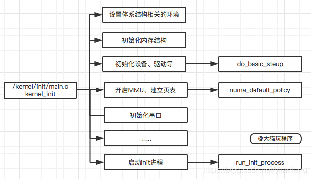

# init进程
***init进程是Linux系统中用户空间的第一个进程, 进程号为1. 当Bootloader启动后, 启动Kernel, Kernel启动完成后, 在用户空间启动init进程, 再通过init进程, 来读取init.rc中的相关配置, 从而来启动其他相关进程以及其他操作.***

**Android init启动进程主要分三个阶段**
1. init被启动
2. init进程启动的源码
3. rc语法分析

## 1. 概览
**init进程是Linux系统中用户空间的第一个进程, 进程号为1.**  
**当Bootloader启动后, 启动Kernel, Kernel启动完成后, 在用户空间启动init进程, 在通过init进程, 来读取init.rc中的相关配置, 从而来启动其他相关进程以及其他操作.**
**init进程被赋予了很多重要工作, init进程启动主要分为两个阶段:**
1. 第一个阶段完成以下内容:
    * ueventd/watchdogd跳转及环境变量设置
    * 挂载文件系统并创建目录
    * 初始化日志输出, 挂载分区设备
    * 启用SELinux安全策略
    * 开始第二阶段前的准备
2. 第二阶段完成以下内容:
    * 初始化属性系统
    * 执行SELinux第二阶段并恢复一些文件安全上下文
    * 新建epoll并初始化子进程终止信号处理函数
    * 设置其他系统属性并开启属性服务
## 2. 架构
###  2.1. init进程启动过程

* init进程是在Kernel启动后, 启动的第一个用户进程, PID是1
* kernel_init启动后, 完成一些init的初始化操作, 然后去系统根目录下依次找ramdisk_execute_command和execute_command设置的应用程序, 如果这两个目录都找不到, 就依次去根目录找/sbin/init, /etc/init, /bin/init, /bin/sh这四个应用程序进行启动, 只要这些应用程序有一个启动了, 其他就不启动了.
* Android系统一般会在根,目录下方一个init的可执行文件, 也就是说Linux系统的init进程在内核初始化完成后, 就直接执行init文件.

### 2.2. init进程启动后的操作

* init进程启动后, 首先挂载文件系统, 再挂载相应的分区, 启动SELinux安全策略, 启动属性服务, 解析rc文件, 并启动相应属性服务进程, 初始化epoll, 以此设置signal, property, keychord这三个fd可读时相应的回调函数. 进入无限循环, 用来响应各个进程的变化与重建.

## 3. Kernel启动init进程流程
### 3.1 kernel_init
* 源码
```cpp
    static int __ref kernel_init(void *unused)
    {
        int ret;
        kernel_init_freeable(); // 进行init进程的一些初始化操作
        async_synchronize_full(); // 等待所有的异步调用执行完成, 在释放内存前, 必须完成所有的异步 __init代码
        ftrace_free_init_mem(); 
        free_initmem();// 释放所有init.*段中的代码
        mark_readonly();
        system_state = SYSTEM_RUNNING; // 设置系统状态为运行状态
        numa_default_policy(); // 设定NUMA系统的默认内存访问策略

        rcu_end_inkernel_boot();
    #ifdef CONFIG_MTPROF
            log_boot("Kernel_init_done");
    #endif
        if (ramdisk_execute_command) { // ramdisk_execute_command的值为"/init"
            ret = run_init_process(ramdisk_execute_command);
            if (!ret)
                return 0;
            pr_err("Failed to execute %s (error %d)\n", ramdisk_execute_command, ret);
        }

        if (execute_command) {
            ret = run_init_process(execute_command); // execute_command的值如果有定义就去根目录下找对应的应用程序, 然后启动
            if (!ret)
                return 0;
            panic("Requested init %s failed (error %d).", execute_command, ret);
        }
        if (!try_to_run_init_process("/sbin/init") || !try_to_run_init_process("/etc/init") || !try_to_run_init_process("/bin/init") || !try_to_run_init_process("/bin/sh"))//如果ramdisk_execute_command和execute_command定义的应用程序都没有找到, 就到根目录下找 /sbin/init, /etc/init, /bin/init, /bin/sh 这四个应用程序进行启动
            return 0;
        panic("No working init found.  Try passing init= option to kernel. See Linux Documentation/admin-guide/init.rst for guidance.");
    }
```