# 关于ViewRootImpl事件分发
* 事件分发
    1. 硬件
    2. ViewRootImpl
    3. DecorView
    4. PhoneView
    5. Activity

## ViewRootImpl事件分发过程
* 源代码
    ```java
        @UnsupportedAppUsage
        public void dispatchInputEvent(InputEvent event, InputEventReceiver receiver) {
            SomeArgs args = SomeArgs.obtain();
            args.arg1 = event;
            args.arg2 = receiver;
            Message msg = mHandler.obtainMessage(MSG_DISPATCH_INPUT_EVENT, args);
            msg.setAsynchronous(true);
            mHandler.sendMessage(msg);
        }
    ```
    * InputEvent: 输入事件的基类, 它有两个实现类
        1. KeyEvent: 键盘输入事件
        2. MotionEvent: 屏幕触摸事件
    * InputEventReceiver: 为应用程序提供了一个低级的机制来接受输入事件. 也就是用来接收输入事件的, 然后交给ViewRootImpl的dispatchInputEvent去分发
    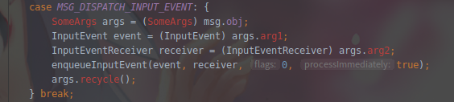
    ```java
        @UnsupportedAppUsage
        void enqueueInputEvent(InputEvent event,
                InputEventReceiver receiver, int flags, boolean processImmediately) {
            QueuedInputEvent q = obtainQueuedInputEvent(event, receiver, flags);// 取出mQueuedInputEventPool头部对event进行封装(如果存在), 不存在就新建节点
            QueuedInputEvent last = mPendingInputEventTail;
            if (last == null) {
                mPendingInputEventHead = q;
                mPendingInputEventTail = q;
            } else {
                last.mNext = q;
                mPendingInputEventTail = q;
            }
            mPendingInputEventCount += 1;
            // 将封装好的QueuedInputEvent追加到mPendingInputEventTail后面
            Trace.traceCounter(Trace.TRACE_TAG_INPUT, mPendingInputEventQueueLengthCounterName, mPendingInputEventCount);
            // 判断是同步执行还是异步执行
            if (processImmediately) {
                doProcessInputEvents();
            } else {
                scheduleProcessInputEvents();
            }
        }
    ```
    * QueuedInputEvent相当于一个链表的节点
        * 同步
        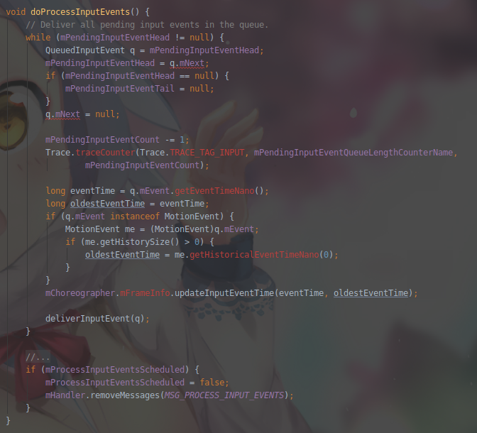
        * 异步(最后还是调用了doProcessInputEvents)
        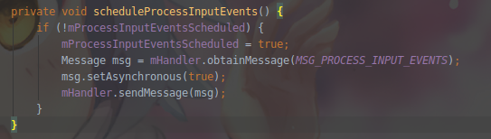
        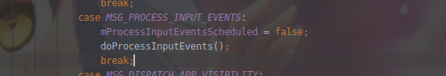
    * doProcessInputEvents: 首先从mPendingInputEventHead循环取出头部节点, 直至链表为空, 然后调用deliverInputEvent分发事件, 然后分发完事件后, 清除标记
    * deliverInputEvent
    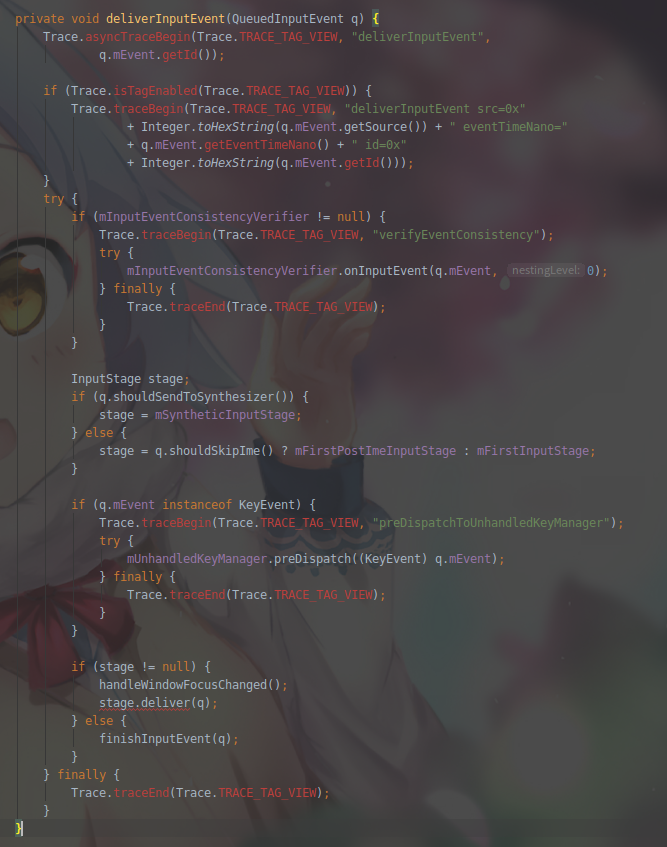
        1. mInputEventConsistencyVerifier != null: 校验输入事件
        2. InputStage是一个提供了实现处理输入事件的方法, 也可以转发给其他事件处理, 具体的处理则是看它的实现类. 每种InputStage可以处理一定的事件类型, 比如AsyncInputStage, ViewPreImeInputStage, ViewPostImeInputStage等. 当一个InputEvent到来时, InputStage的处理情况如下图所示
        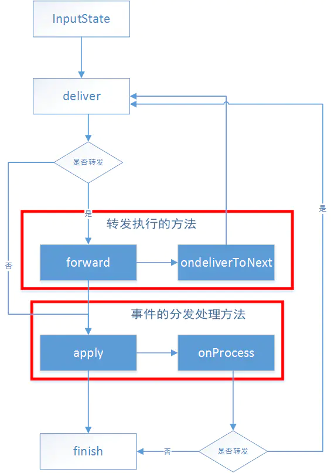
        3. 最终的事件分发处理则是在apply方法里的onProcess方法, 里面会根据不同的事件来进行分发(键盘事件/触摸事件)
        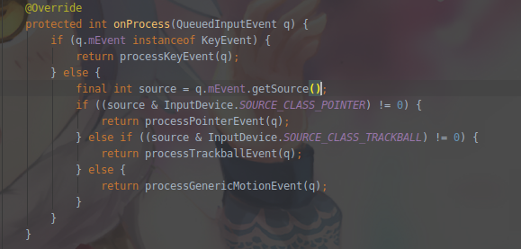
        4. 关于触摸事件processPointerEvent
        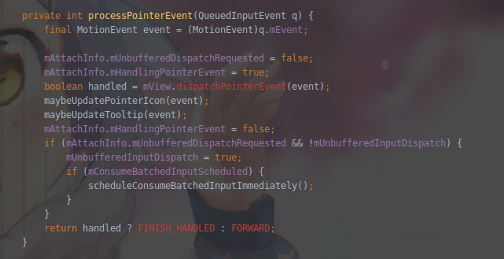
        5. 最后调用mView.dispatchPointerEvent(event)来分发事件, 这里的mView就是DecorView
        6. mView是在Activity创建过程中调用setView设置的(ActivityThread.handleResumeActivity->WindowManager.addView->WindowManagerGlobal.addView->ViewRootImpl.setView)
        7. View中的dispatchPointerEvent
        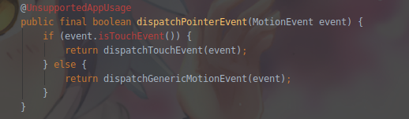
        8. DecorView中dispatchTouchEvent
        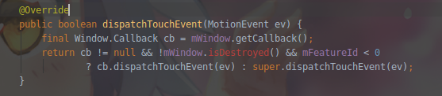
        9. 这里调用了Callback的回调, Callback是Window的一个接口, 这个接口是Activity来实现的, 在Activity创建的时候, 调用attach方法来将Activity设置到Window中, 然后调用Activity中的回调函数
    
## 总结
* ViewRootImpl事件分发流程图
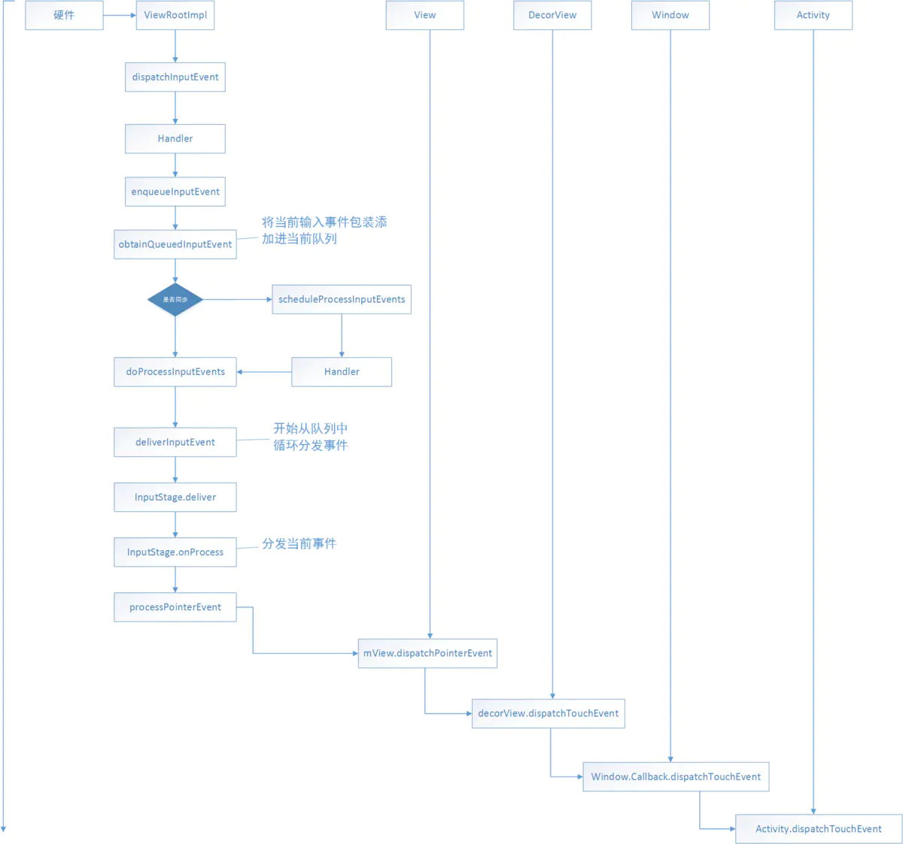


