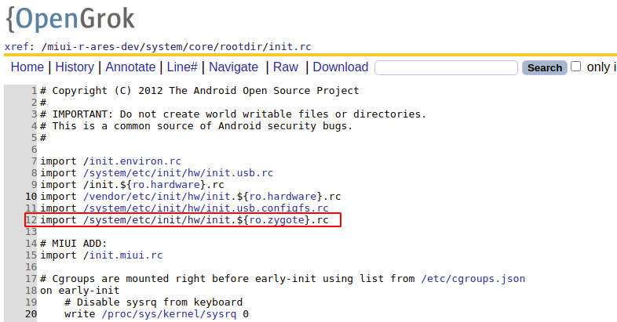
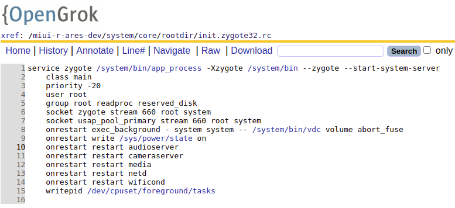

# zygote

1. 首先在init.rc中加载zygote的配置文件

2. 在zygote中执行命令启动zygote服务

3. 可以看到是通过app_process来启动的服务(命令: `service zygote /system/bin/app_process -Xzygote /system/bin --zygote --start-system-server`), 下面分析app_process
```cpp
    ...
    int main(int argc, char* const argv[])
    {
        ...
        AppRuntime runtime(argv[0], computeArgBlockSize(argc, argv));
        // 忽略命令中的/system/bin/app_process
        argc--;
        argv++;

        const char* spaced_commands[] = { "-cp", "-classpath" };
        bool known_command = false;

        // 加载/system/bin之前的参数
        // 这个循环只会添加-Xzygote参数
        int i;
        for (i = 0; i < argc; i++) {
            if (known_command == true) {
                runtime.addOption(strdup(argv[i]));
                ALOGV("app_process main add known option '%s'", argv[i]);
                known_command = false;
                continue;
            }

            for (int j = 0; j < static_cast<int>(sizeof(spaced_commands) / sizeof(spaced_commands[0])); ++j) {
                if (strcmp(argv[i], spaced_commands[j]) == 0) {
                    known_command = true;
                    ALOGV("app_process main found known command '%s'", argv[i]);
                }
            }

            if (argv[i][0] != '-') {
                break;
            }
            if (argv[i][1] == '-' && argv[i][2] == 0) {
                ++i;
                break;
            }

            runtime.addOption(strdup(argv[i]));
            
            ALOGV("app_process main add option '%s'", argv[i]);
        }

        bool zygote = false;
        bool startSystemServer = false;
        bool application = false;
        String8 niceName;
        String8 className;

        ++i; // 跳过/system/bin参数
        // 加载/system/bin后面的参数
        while (i < argc) {
            const char* arg = argv[i++];
            if (strcmp(arg, "--zygote") == 0) {
                zygote = true;
                niceName = ZYGOTE_NICE_NAME;
            } else if (strcmp(arg, "--start-system-server") == 0) {
                startSystemServer = true;
            } else if (strcmp(arg, "--application") == 0) {
                application = true;
            } else if (strncmp(arg, "--nice-name=", 12) == 0) {
                niceName.setTo(arg + 12);
            } else if (strncmp(arg, "--", 2) != 0) {
                className.setTo(arg);
                break;
            } else {
                --i;
                break;
            }
        }

        Vector<String8> args;
        if (!className.isEmpty()) {
            args.add(application ? String8("application") : String8("tool"));
            runtime.setClassNameAndArgs(className, argc - i, argv + i);
            ...
        } else {
            maybeCreateDalvikCache();

            if (startSystemServer) {
                args.add(String8("start-system-server"));
            }

            char prop[PROP_VALUE_MAX];
            if (property_get(ABI_LIST_PROPERTY, prop, NULL) == 0) {
                LOG_ALWAYS_FATAL("app_process: Unable to determine ABI list from property %s.",
                    ABI_LIST_PROPERTY);
                return 11;
            }

            // 读取--abi-list
            String8 abiFlag("--abi-list=");
            abiFlag.append(prop);
            args.add(abiFlag);

            for (; i < argc; ++i) {
                // 加入 --zygote后面的参数
                args.add(String8(argv[i]));
            }
        }

        if (!niceName.isEmpty()) {
            runtime.setArgv0(niceName.string(), true);
        }

        if (zygote) {
            // MIUI ADD:
            signal(SIGHUP, SIG_IGN);
            // 启动zygote
            runtime.start("com.android.internal.os.ZygoteInit", args, zygote);
        } else if (className) {
            runtime.start("com.android.internal.os.RuntimeInit", args, zygote);
        } else {
            fprintf(stderr, "Error: no class name or --zygote supplied.\n");
            app_usage();
            LOG_ALWAYS_FATAL("app_process: no class name or --zygote supplied.");
        }
    }
```