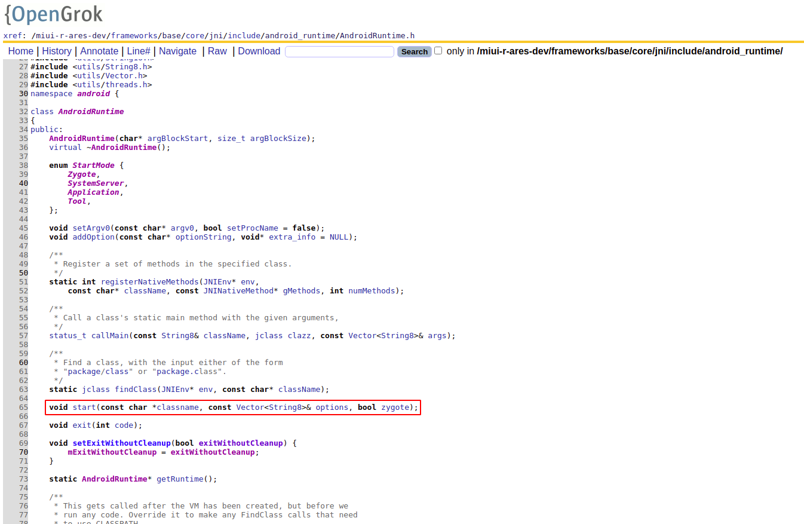

# zygote
1. zygote是通过runtime进行启动的, runtime是AppRuntime的对象, 而AppRuntime是继承自AndroidRuntime的, 所以下面分析医学AndroidRuntime的start方法
2. AndroidRuntime.start不是一个虚函数, 所以它的子类无法重写该函数

3. start函数的实现
```cpp
    void AndroidRuntime::start(const char* className, const Vector<String8>& options, bool zygote)
    {
        ALOGD(">>>>>> START %s uid %d <<<<<<\n", className != NULL ? className : "(unknown)", getuid());

        static const String8 startSystemServer("start-system-server");

        bool primary_zygote = false;
        // MIUI ADD:
        long boot_start = 0;
        // 启动参数包含start-system-server时, primary_zygote为true, 即在执行启动命令时, 包含参数 --start-system-server, 这里会是true
        for (size_t i = 0; i < options.size(); ++i) {
            if (options[i] == startSystemServer) {
                primary_zygote = true;
                const int LOG_BOOT_PROGRESS_START = 3000;
                // MIUI MOD:
                boot_start = ns2ms(systemTime(SYSTEM_TIME_MONOTONIC));
                LOG_EVENT_LONG(LOG_BOOT_PROGRESS_START, boot_start);
                addBootEvent("boot_progress_start");
            }
        }

        // 根据环境变量, 获取各个目录
        const char* rootDir = getenv("ANDROID_ROOT");
        if (rootDir == NULL) {
            rootDir = "/system";
            if (!hasDir("/system")) {
                LOG_FATAL("No root directory specified, and /system does not exist.");
                return;
            }
            setenv("ANDROID_ROOT", rootDir, 1);
        }

        const char* artRootDir = getenv("ANDROID_ART_ROOT");
        if (artRootDir == NULL) {
            LOG_FATAL("No ART directory specified with ANDROID_ART_ROOT environment variable.");
            return;
        }

        const char* i18nRootDir = getenv("ANDROID_I18N_ROOT");
        if (i18nRootDir == NULL) {
            LOG_FATAL("No runtime directory specified with ANDROID_I18N_ROOT environment variable.");
            return;
        }

        const char* tzdataRootDir = getenv("ANDROID_TZDATA_ROOT");
        if (tzdataRootDir == NULL) {
            LOG_FATAL("No tz data directory specified with ANDROID_TZDATA_ROOT environment variable.");
            return;
        }

        // 启动虚拟机
        JniInvocation jni_invocation;
        jni_invocation.Init(NULL);
        JNIEnv* env;
        if (startVm(&mJavaVM, &env, zygote, primary_zygote) != 0) {
            return;
        }
        onVmCreated(env);
        // 为虚拟机注册JNI方法
        if (startReg(env) < 0) {
            ALOGE("Unable to register all android natives\n");
            return;
        }

        jclass stringClass;
        jobjectArray strArray;
        jstring classNameStr;

        // 将start方法中传递的className设置到strArray的第一个参数中
        stringClass = env->FindClass("java/lang/String");
        assert(stringClass != NULL);
        strArray = env->NewObjectArray(options.size() + 1, stringClass, NULL);
        assert(strArray != NULL);
        classNameStr = env->NewStringUTF(className);
        assert(classNameStr != NULL);
        env->SetObjectArrayElement(strArray, 0, classNameStr);
        // 将options剩余参数追加到strArray中
        for (size_t i = 0; i < options.size(); ++i) {
            jstring optionsStr = env->NewStringUTF(options.itemAt(i).string());
            assert(optionsStr != NULL);
            env->SetObjectArrayElement(strArray, i + 1, optionsStr);
        }

        // 将字符串com.android.internal.os.ZygoteInit换成字符串com/android/internal/os/ZygoteInit
        char* slashClassName = toSlashClassName(className != NULL ? className : "");
        // 找到ZygoteInit类并拿到main函数
        jclass startClass = env->FindClass(slashClassName);
        if (startClass == NULL) {
            ALOGE("JavaVM unable to locate class '%s'\n", slashClassName);
        } else {
            // MIUI ADD: START
            if (boot_start != 0) {
                jfieldID field = env->GetStaticFieldID(startClass, "BOOT_START_TIME", "J");
                if (field != NULL) {
                    env->SetStaticLongField(startClass, field, boot_start);
                }
            }
            // END
            jmethodID startMeth = env->GetStaticMethodID(startClass, "main",
                "([Ljava/lang/String;)V");
            if (startMeth == NULL) {
                ALOGE("JavaVM unable to find main() in '%s'\n", className);
            } else {
                // 执行main函数, 并把参数传递进去
                env->CallStaticVoidMethod(startClass, startMeth, strArray);
    #if 0
                if (env->ExceptionCheck())
                    threadExitUncaughtException(env);
    #endif
            }
        }
        // 执行完成, 释放字符串资源
        free(slashClassName);
        // 销毁创建的虚拟机
        ALOGD("Shutting down VM\n");
        if (mJavaVM->DetachCurrentThread() != JNI_OK)
            ALOGW("Warning: unable to detach main thread\n");
        if (mJavaVM->DestroyJavaVM() != 0)
            ALOGW("Warning: VM did not shut down cleanly\n");
    }
```
4. ZygoteInit.main函数
```java
    // 这是zygote的入口方法, 它创建zygote服务, 加载资源,并处理和准备其他应用进程
   @UnsupportedAppUsage
   public static void main(String argv[]) {
       ZygoteServer zygoteServer = null;

       // 调用native函数, 确保没有其它线程在运行
       ZygoteHooks.startZygoteNoThreadCreation();

       try {
           // 设置pid, zygote进入自己的进程组
           Os.setpgid(0, 0);
       } catch (ErrnoException ex) {
           throw new RuntimeException("Failed to setpgid(0,0)", ex);
       }

       Runnable caller;
       try {

           final long startTime = SystemClock.elapsedRealtime();
           final boolean isRuntimeRestarted = "1".equals(
                   SystemProperties.get("sys.boot_completed"));

           String bootTimeTag = Process.is64Bit() ? "Zygote64Timing" : "Zygote32Timing";
           TimingsTraceLog bootTimingsTraceLog = new TimingsTraceLog(bootTimeTag,
                   Trace.TRACE_TAG_DALVIK);
           bootTimingsTraceLog.traceBegin("ZygoteInit");
           RuntimeInit.preForkInit();

           // MIUI ADD:
           miui.security.SecurityManager.init();

           boolean startSystemServer = false;
           String zygoteSocketName = "zygote";
           String abiList = null;
           boolean enableLazyPreload = false;
           // 读取启动参数
           for (int i = 1; i < argv.length; i++) {
               if ("start-system-server".equals(argv[i])) {
                   startSystemServer = true; // 启动zygote时, 才会传入参数start-system-server
               } else if ("--enable-lazy-preload".equals(argv[i])) {
                   enableLazyPreload = true;// 启动zygote_secondary时, 才会传入参数
               } else if (argv[i].startsWith(ABI_LIST_ARG)) {
                   abiList = argv[i].substring(ABI_LIST_ARG.length());
               } else if (argv[i].startsWith(SOCKET_NAME_ARG)) {
                   zygoteSocketName = argv[i].substring(SOCKET_NAME_ARG.length());
               } else {
                   throw new RuntimeException("Unknown command line argument: " + argv[i]);
               }
           }

           final boolean isPrimaryZygote = zygoteSocketName.equals(Zygote.PRIMARY_SOCKET_NAME);
           if (!isRuntimeRestarted) {
               if (isPrimaryZygote) {
                   FrameworkStatsLog.write(FrameworkStatsLog.BOOT_TIME_EVENT_ELAPSED_TIME_REPORTED,
                           BOOT_TIME_EVENT_ELAPSED_TIME__EVENT__ZYGOTE_INIT_START,
                           startTime);
               } else if (zygoteSocketName.equals(Zygote.SECONDARY_SOCKET_NAME)) {
                   FrameworkStatsLog.write(FrameworkStatsLog.BOOT_TIME_EVENT_ELAPSED_TIME_REPORTED,
                           BOOT_TIME_EVENT_ELAPSED_TIME__EVENT__SECONDARY_ZYGOTE_INIT_START,
                           startTime);
               }
           }

           if (abiList == null) {
               throw new RuntimeException("No ABI list supplied.");
           }

           // In some configurations, we avoid preloading resources and classes eagerly.
           // In such cases, we will preload things prior to our first fork.
           if (!enableLazyPreload) {
               bootTimingsTraceLog.traceBegin("ZygotePreload");
               EventLog.writeEvent(LOG_BOOT_PROGRESS_PRELOAD_START,
                       SystemClock.uptimeMillis());
               /// M: Added for BOOTPROF
               addBootEvent("Zygote:Preload Start");
               /// @}
               preload(bootTimingsTraceLog);
               EventLog.writeEvent(LOG_BOOT_PROGRESS_PRELOAD_END,
                       SystemClock.uptimeMillis());
               bootTimingsTraceLog.traceEnd(); // ZygotePreload
           }

           // Do an initial gc to clean up after startup
           bootTimingsTraceLog.traceBegin("PostZygoteInitGC");
           gcAndFinalize();
           bootTimingsTraceLog.traceEnd(); // PostZygoteInitGC

           bootTimingsTraceLog.traceEnd(); // ZygoteInit

           Zygote.initNativeState(isPrimaryZygote);

           /// M: Added for BOOTPROF
           addBootEvent("Zygote:Preload End");
           /// @}
           ZygoteHooks.stopZygoteNoThreadCreation();

           zygoteServer = new ZygoteServer(isPrimaryZygote);

           if (startSystemServer) {
               Runnable r = forkSystemServer(abiList, zygoteSocketName, zygoteServer);

               // {@code r == null} in the parent (zygote) process, and {@code r != null} in the
               // child (system_server) process.
               if (r != null) {
                   r.run();
                   return;
               }
           }

           Log.i(TAG, "Accepting command socket connections");

           // The select loop returns early in the child process after a fork and
           // loops forever in the zygote.
           caller = zygoteServer.runSelectLoop(abiList);
       } catch (Throwable ex) {
            Log.e(TAG, "System zygote died with exception", ex);
            throw ex;
        } finally {
            if (zygoteServer != null) {
                zygoteServer.closeServerSocket();
            }
        }

        // We're in the child process and have exited the select loop. Proceed to execute the
        // command.
        if (caller != null) {
            caller.run();
        }
    }
```
