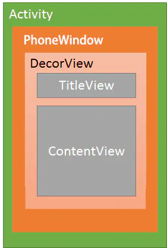

# Android窗口结构

* 关于Android窗口结构, 如下图所示  

## 说明
1. 每个Activity都具有一个Window,  这个对象通常是PhoneWindow类型
2. PhoneWindow是Window的实现类, 是Android中最基本的窗口系统, 每一个Activity都会具有一个PhoneWindow对象, 是Activity与整个View系统交互的接口, 同时也是将DecorView设置为整个应用窗口的根View的对象
3. DecorView是顶层视图, 它将要显示的内容呈现在PhoneWindow上, 它是Activity中所有View的根节点, 它并不会向用户呈现任何东西, 它主要有如下几个功能:
    * 分发来自ViewRoot的按键, 触摸, 跟踪等事件
    * DecorView具有一个直接的子View, 这View是从系统的布局中解析而来, 它包含当前UI的风格(是否带title, 是否具有process bar等), 这些属性称为Window Decorations
    * 作为PhoneWindow与ViewRoot的桥梁, ViewRoot可以通过DecorView设置PhoneWindow的属性
    * DecorView是一个FrameLayout子类, 它只包含一个LinearLayout, 其中LinearLayout分为两部分, ActionBar和ContentParent, ContentParent即是我们在Activity中加载的布局.

## 参考
* [简书](https://www.jianshu.com/p/40a9c93b5a8d)