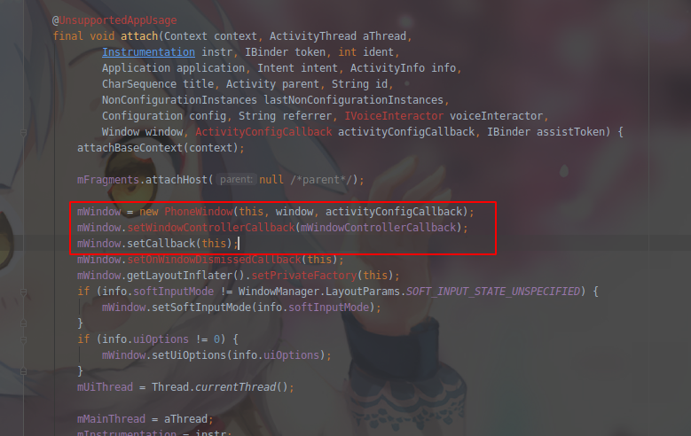

# 关于PhoneWindow, DecorView

## Window
* 顶级窗口外观和行为策略的抽象基类, 它提供了标准的UI策略, 例如背景, 标题区域, 默认按键处理等. 此类只有一个实现类PhoneWindow.

## PhoneWindow
* Window的唯一实现类
* PhoneWindow里有一个DecorView的成员变量, DecorView继承自FrameLayout

## DecorView
* DecorView是一个FrameLayout, 它可以加载布局, App的标题栏, 内容等, 从顶级上看是加载到DecorView中, 而DecorView是由PhoneWindow负责添加的


## 二者关系及setContentView函数
* Activity.setContentView的代码
    ```java
        public void setContentView(@LayoutRes int layoutResID) {
            getWindow().setContentView(layoutResID);
            initWindowDecorActionBar();
        }
    ```
    * 分析可知, 它首先会通过getWindow()函数拿到Window对象(PhoneWindow的实例化对象), 然后调用Window中的setContentView方法, 如果Window是null, 代表当前活动不可见
* PhoneWindow.setContentView的代码
    ```java
        @Override
        public void setContentView(int layoutResID) {
            //  注意：当主题属性等明确化时，可以在安装窗口装饰的过程中设置FEATURE_CONTENT_TRANSITIONS。在这种情况发生之前，请勿检查该功能。
            if (mContentParent == null) {
                installDecor();
            } else if (!hasFeature(FEATURE_CONTENT_TRANSITIONS)) {
                mContentParent.removeAllViews();
            }

            if (hasFeature(FEATURE_CONTENT_TRANSITIONS)) {
                final Scene newScene = Scene.getSceneForLayout(mContentParent, layoutResID,
                        getContext());
                transitionTo(newScene);
            } else {
                mLayoutInflater.inflate(layoutResID, mContentParent);
            }
            mContentParent.requestApplyInsets();
            final Callback cb = getCallback();
            if (cb != null && !isDestroyed()) {
                cb.onContentChanged();
            }
            mContentParentExplicitlySet = true;
        }
    ```
    * 当第一次调用时, mContentParent为空, 此时调用installDecor方法来创建DecorView
    * FEATURE_CONTENT_TRANSITIONS作用是判断当前内容有没有使用过渡动画, 如果内容已经加载完成并且不需要动画, 则会调用removeAllViews方法
    * 初始化完mContentParent后, 如果有设置过渡动画, 则添加Scene来过渡启动, 否则将通过LayoutInflater对象的inflate方法将资源文件转换为View树, 并将其添加到mContentParent中
* installDecor的代码
    ```java
    private void installDecor() {
        mForceDecorInstall = false;
        if (mDecor == null) {
            mDecor = generateDecor(-1);
            mDecor.setDescendantFocusability(ViewGroup.FOCUS_AFTER_DESCENDANTS);
            mDecor.setIsRootNamespace(true);
            if (!mInvalidatePanelMenuPosted && mInvalidatePanelMenuFeatures != 0) {
                mDecor.postOnAnimation(mInvalidatePanelMenuRunnable);
            }
        } else {
            mDecor.setWindow(this);
        }
        if (mContentParent == null) {
            mContentParent = generateLayout(mDecor);
        }
        ...
    }
    ```
    * 这里首先通过generateDecor来创建DecorView, 代码如下
    ```java
    protected DecorView generateDecor(int featureId) {
        // 系统过程没有应用上下文，在这种情况下，我们需要直接使用我们的上下文, 所以我们不拘泥于活动。   
        Context context;
        if (mUseDecorContext) {
            Context applicationContext = getContext().getApplicationContext();
            if (applicationContext == null) {
                context = getContext();
            } else {
                context = new DecorContext(applicationContext, this);
                if (mTheme != -1) {
                    context.setTheme(mTheme);
                }
            }
        } else {
            context = getContext();
        }
        return new DecorView(context, featureId, this, getAttributes());
    }
    ```
    * 然后generateLayout创建mContentParent并将DecorView设置进去, 代码如下
    ```java
    protected ViewGroup generateLayout(DecorView decor) {
        //根据当前设置的主题来加载默认布局
        TypedArray a = getWindowStyle();
        //如果你在theme中设置了window_windowNoTitle，则这里会调用到，其他方法同理，
        //这里是根据你在theme中的设置去设置的
        if (a.getBoolean(R.styleable.Window_windowNoTitle, false)) {
            requestFeature(FEATURE_NO_TITLE);
        } else if (a.getBoolean(R.styleable.Window_windowActionBar, false)) {
            requestFeature(FEATURE_ACTION_BAR);
        }
        //是否有设置全屏
        if (a.getBoolean(R.styleable.Window_windowFullscreen, false)) {
            setFlags(FLAG_FULLSCREEN, FLAG_FULLSCREEN & (~getForcedWindowFlags()));
        }
        
        ...//省略其他加载资源
        
        // 添加布局到DecorView，前面说到，DecorView是继承与FrameLayout，它本身也是一个ViewGroup，而我们前面创建它的时候，只是调用了new DecorView，此时里面并无什么东西。而下面的步奏则是根据用户设置的Feature来创建相应的默认布局主题。举个例子，如果我在setContentView之前调用了requestWindowFeature(Window.FEATURE_NO_TITLE)，这里则会通过getLocalFeatures来获取你设置的feature，进而选择加载对应的布局，此时则是加载没有标题栏的主题，对应的就是R.layout.screen_simple

        int layoutResource;
        int features = getLocalFeatures();
        ...
        mDecor.startChanging();
        // 各种判断条件 加载layoutResource
        //选择对应布局创建添加到DecorView中
        mDecor.onResourcesLoaded(mLayoutInflater, layoutResource);

        ViewGroup contentParent = (ViewGroup)findViewById(ID_ANDROID_CONTENT);
        ...
        return contentParent;
    }
    ```
    * generateLayout会根据用户设置的主题去设置对应的Feature, 然后根据对应的Feature加载相应的布局文件, 布局文件代码如下
    ```xml
    <LinearLayout xmlns:android="http://schemas.android.com/apk/res/android"
        android:layout_width="match_parent"
        android:layout_height="match_parent"
        android:fitsSystemWindows="true"
        android:orientation="vertical">
        <ViewStub android:id="@+id/action_mode_bar_stub"
                android:inflatedId="@+id/action_mode_bar"
                android:layout="@layout/action_mode_bar"
                android:layout_width="match_parent"
                android:layout_height="wrap_content"
                android:theme="?attr/actionBarTheme" />
        <FrameLayout
            android:id="@android:id/content"
            android:layout_width="match_parent"
            android:layout_height="match_parent"
            android:foregroundInsidePadding="false"
            android:foregroundGravity="fill_horizontal|top"
            android:foreground="?android:attr/windowContentOverlay" />
    </LinearLayout>
    ```
    * 布局中包含两个元素, 上面是ActionBar, 下面是Content, 这与前面提到的布局相一致.
    * generateLayout返回的最终是contentParent, 这个是通过findViewById(ID_ANDROID_CONTENT)得到的, 而ID_ANDROID_CONTENT是上面的FrameLayout的id, 所以mContentParent实际上就是这个FrameLayout
* Callback, 当把布局加载到content中后, 会执行Callback的回调函数, Callback是一个接口, 其里面声明了当界面改变触摸时调用的各种方法
    * 查看Callback的实现类, 发现Activity是它的实现类, 所以我们分析一下Activity中的onContentChanged
        ```java
        public void onContentChanged() {
        }
        ```
    * 可以发现这个方法是一个空实现, 也就是说Android SDK给我们预留了接口, 可以通过重写这个方法来监听布局的变化
    * 关于为什么CallBack是Activity, 我们可以分析Activity的源码得到, 它是在attach方法中设置的
    

## 总结
* Window是一个抽象类，提供了各种窗口操作的方法，比如设置背景标题ContentView等
* PhoneWindow是Window的唯一实现类, 它里面实现了各种添加背景, 主题, ContentView的方法，内部通过DecorView来添加顶级视图
* 每一个Activity上面都有一个Window,可以通过getWindow来获取
* DecorView是顶级视图, 它继承自FramentLayout, setContentView会将布局添加到@id/content里
* setContentView里面创建了DecorView, 根据Theme, Feature添加了对应的布局文件, setContentView设置完成后, 会调用Activity的onContentChanged方法

## 参考
* [简书](https://www.jianshu.com/p/e42b638944ae)