# Window, WindowManager与Activity

* Window, WindowManager的结构图
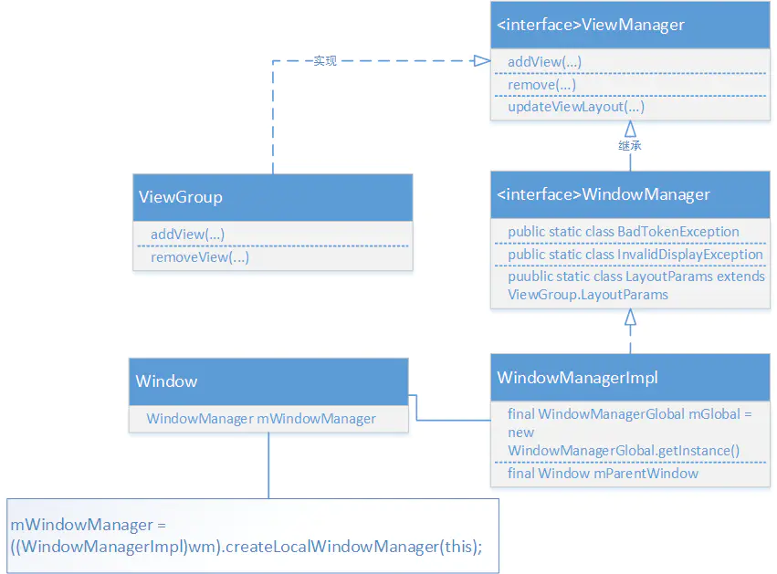

## 关于图中的各个类

### 1. ViewManager
* 源代码
    ```java
    public interface ViewManager
    {
        public void addView(View view, ViewGroup.LayoutParams params);
        public void updateViewLayout(View view, ViewGroup.LayoutParams params);
        public void removeView(View view);
    }
    ```
* 可以看到ViewManager是一个接口, 它里面定义了一组规则, 也就是添加, 更新, 删除View的接口, 即ViewManager是用来添加, 更新和删除Activity中View的接口, 可以通过Context.getSystemService()获取实例

### 2. ViewGroup
* 源代码
    ```java
    public abstract class ViewGroup extends View implements ViewParent, ViewManager {
        ...
        public void addView(View child) {
            addView(child, -1);
        }
        ...
        public void addView(View child, int index) {
            if (child == null) {
                throw new IllegalArgumentException("Cannot add a null child view to a ViewGroup");
            }
            LayoutParams params = child.getLayoutParams();
            if (params == null) {
                params = generateDefaultLayoutParams();
                if (params == null) {
                    throw new IllegalArgumentException(
                            "generateDefaultLayoutParams() cannot return null");
                }
            }
            addView(child, index, params);
        }
        ...
        public void addView(View child, int index, LayoutParams params) {
            if (DBG) {
                System.out.println(this + " addView");
            }

            if (child == null) {
                throw new IllegalArgumentException("Cannot add a null child view to a ViewGroup");
            }
            requestLayout();
            invalidate(true);
            addViewInner(child, index, params, false);
        }
        ...
    }
    ```
    * ViewGroup实现了ViewManager接口, View通过ViewGroup的addView方法添加到ViewGroup中, 而ViewGroup层层嵌套到最顶级都会显示在一个窗口的Window中

### 3. WindowManager
* 源代码(代码太多, 这里只拷贝关键代码)
    ```java
    public interface WindowManager extends ViewManager {
        public static class BadTokenException extends RuntimeException {
            ...
        }
        public static class InvalidDisplayException extends RuntimeException {
            ...
        }
        public Display getDefaultDisplay()；
        public void removeViewImmediate(View view);
        public static class LayoutParams extends ViewGroup.LayoutParams implements Parcelable {
            ...
        }
        ...
    }
    ```
    * WindowManager是一个接口, 继承自ViewManager, WindowManager意思是窗口管理器, 每一个窗口管理器都与一个窗口的显示绑定. 通过Context.getSystemService(Context.WINDOW_SERVICE)获取实例, 因为其继承了ViewManager, 所以它可以进行添加删除View, 不过具体实现在其实现类WindowManagerImpl中.
    * 关于BadTokenException
        1. 当addView时, 它的LayoutParams无效则会抛出
        2. 添加第二个View的时候没有移除第一个View会抛出
    * 关于InvalidDisplayException
        * 如果一INDOW_SERVICE)获取实例, 因为其继承了ViewManager, 所以它可以进行添加删除View, 不过具体实现在其实现类WindowManagerImpl中.
    * 关于BadTokenException
        1. 当addView时, 它的LayoutParams无效则会抛出
        2. 添加第二个View的时候没有移除第一个View会抛出
    * 关于InvalidDisplayException
        * 如果一个窗口是在一个二级的显示上, 而指定的显示找不到则会被抛出
    * 关于getDefaultDisplay
        * 返回当前WindowManager管理的显示Display
    * 关于removeViewImmediate
        * 表示从窗口上移除View, 一般是当View调用了onDetachedFromWindow也就是从Window上分开后, 把它移除
    * 关于LayoutParams
        * Window的布局参数, 里面定义了一系列的窗口属性
    

### 4. WindowManagerImpl
* 源代码(部分)
    ```java
    public final class WindowManagerImpl implements WindowManager {
        private final WindowManagerGlobal mGlobal = WindowManagerGlobal.getInstance();
        private final Display mDisplay;
        private final Window mParentWindow;
        @Override
        public void addView(@NonNull View view, @NonNull ViewGroup.LayoutParams params) {
            applyDefaultToken(params);
            mGlobal.addView(view, params, mContext.getDisplayNoVerify(), mParentWindow, mContext.getUserId());
        }
        ...
        @Override
        public void removeView(View view) {
            mGlobal.removeView(view, false);
        }
    }
    ```
    * 关于增加删除的代码, 可以看到实际上是调用了WindowManagerGlobal里面的方法, WindowManagerImpl只是做了一层嵌套

## 关于这些类之间的联系

* 每一个Activity都会与一个Window绑定在一起, 所以Window的创建和WindowManager的绑定是在创建启动Activity过程中绑定的
* 关于Activity的启动, 有两种方式
    1. 点击程序进入Activity
    2. 通过在已启动的Activity中调用startActivity
* Activity启动期间通过Binder驱动ActivityManagerService, ActivityThread, ApplicationThread, ActivityStack, Activity之间进行通讯, 为当前Activity创建进程, 分配任务栈后启动Activity
* Activity的创建过程 --ActivityThread.handleLaunchActivity
    ```java
        @Override
        public Activity handleLaunchActivity(ActivityClientRecord r, PendingTransactionActions pendingActions, Intent customIntent) {
            unscheduleGcIdler();
            ...
            WindowManagerGlobal.initialize();
            GraphicsEnvironment.hintActivityLaunch();
            final Activity a = performLaunchActivity(r, customIntent);
            if (a != null) {
                r.createdConfig = new Configuration(mConfiguration);
                reportSizeConfigurations(r);
                if (!r.activity.mFinished && pendingActions != null) {
                    pendingActions.setOldState(r.state);
                    pendingActions.setRestoreInstanceState(true);
                    pendingActions.setCallOnPostCreate(true);
                }
            } else {
                ...
            }
            return a;
        }
    ```
    1. WindowManagerGlobal.initialize() 是在创建WindowManagerSerivice(如过没创建的话), 代码如下.
    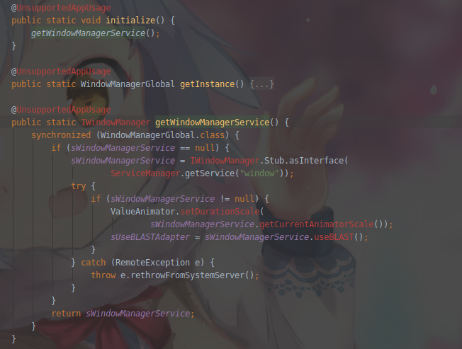
    2. 初始化完WindowManagerSerivice后, 调用performLaunchActivity来创建Activity
        ```java
        private Activity performLaunchActivity(ActivityClientRecord r, Intent customIntent) {
            ...
            Activity activity = null;
            try { 
                //Activity通过ClassLoader创建出来
                java.lang.ClassLoader cl = r.packageInfo.getClassLoader();
                activity = mInstrumentation.newActivity(cl, component.getClassName(), r.intent);  
            } 
            ...
            //创建Application
            try {
                Application app = r.packageInfo.makeApplication(false, mInstrumentation);
                ...
                if (activity != null) {
                    //创建Activity所需的Context
                    Context appContext = createBaseContextForActivity(r, activity);
                    ...
                    //将Context与Activity进行绑定
                    activity.attach(appContext, this, getInstrumentation(), r.token, r.ident, app, r.intent, r.activityInfo,  title, r.parent, r.embeddedID, r.lastNonConfigurationInstances, config, r.referrer, r.voiceInteractor);
                    ...
                    //调用activity.onCreate
                    if (r.isPersistable()) {
                        mInstrumentation.callActivityOnCreate(activity, r.state, r.persistentState);
                    } else {
                        mInstrumentation.callActivityOnCreate(activity, r.state);
                    }
                    ...
                }
                ...
                r.setState(ON_CREATE);
                ...
            }
            ...
            return activity;
        }
        ```
        1. Activity是通过mInstrumentation的newActivity来创建的, 可以发现, 最后是通过ClassLoader反射创建而来的
        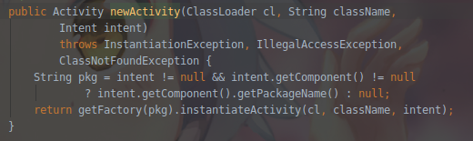
        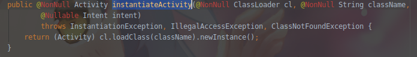
        2. 创建完成Activity后, 接着创建所需要的Application和Context
        3. 然后调用Activity的attach方法来将Application和Context建立关联
            ```java
                final void attach(Context context, ActivityThread aThread, Instrumentation instr, IBinder token, int ident, Application application, Intent intent, ActivityInfo info, CharSequence title, Activity parent, String id, NonConfigurationInstances lastNonConfigurationInstances, Configuration config, String referrer, IVoiceInteractor voiceInteractor) {
                //ContextImpl的绑定
                attachBaseContext(context);
                //在当前Activity创建Window
                mWindow = new PhoneWindow(this);
                mWindow.setCallback(this);
                mWindow.setOnWindowDismissedCallback(this);
                mWindow.getLayoutInflater().setPrivateFactory(this);
                ...
                //为Window设置WindowManager
                mWindow.setWindowManager(
                        (WindowManager)context.getSystemService(Context.WINDOW_SERVICE),
                        mToken, mComponent.flattenToString(),
                        (info.flags & ActivityInfo.FLAG_HARDWARE_ACCELERATED) != 0);
                if (mParent != null) {
                    mWindow.setContainer(mParent.getWindow());
                }
                //创建完后通过getWindowManager就可以得到WindowManager实例
                mWindowManager = mWindow.getWindowManager();
                mCurrentConfig = config;
            }
            ```
            * 在Activity调用attach的时候, 对应的Window对象也被创建(第2篇文章有提到), 同时也将Window和WindowManager进行绑定. mWindow和mWindowManager是Activity的成员变量, mWindowManager是在setWindowManager时创建的
            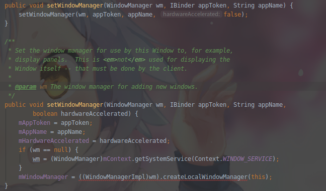
        4. attach方法结束后, 执行mInstrumentation.callActivityOnCreate(activity, r.state, r.persistentState), 即在调用Activity的onCreate方法
        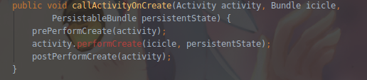
        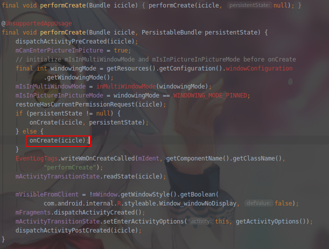
        
* Activity的创建过程 --ActivityThread.handleStartActivity
    ```java
        @Override
        public void handleStartActivity(IBinder token, PendingTransactionActions pendingActions) {
            final ActivityClientRecord r = mActivities.get(token);
            final Activity activity = r.activity;
            ...
            activity.performStart("handleStartActivity");
            r.setState(ON_START);
            ...
            if (pendingActions.shouldRestoreInstanceState()) {
                if (r.isPersistable()) {
                    if (r.state != null || r.persistentState != null) {
                        mInstrumentation.callActivityOnRestoreInstanceState(activity, r.state,
                                r.persistentState);
                    }
                } else if (r.state != null) {
                    mInstrumentation.callActivityOnRestoreInstanceState(activity, r.state);
                }
            }
            if (pendingActions.shouldCallOnPostCreate()) {
                activity.mCalled = false;
                if (r.isPersistable()) {
                    mInstrumentation.callActivityOnPostCreate(activity, r.state,
                            r.persistentState);
                } else {
                    mInstrumentation.callActivityOnPostCreate(activity, r.state);
                }
                ...
            }
            updateVisibility(r, true);
            mSomeActivitiesChanged = true;
        }
    ```
    1. 首先程序将通过IBinder拿到Activity
    2. 通过执行activity.performStart("handleStartActivity")来调用Activity的onStart()方法
    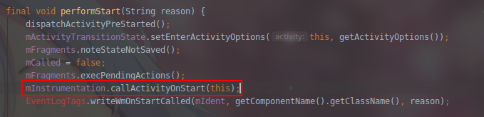
    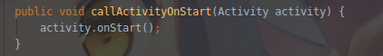
    3. 然后会通过mInstrumentation的callActivityOnRestoreInstanceState方法调用Activity的performRestoreInstanceState方法来恢复数据
    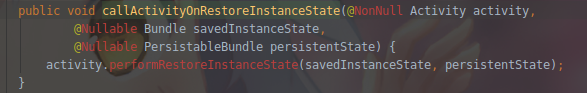
    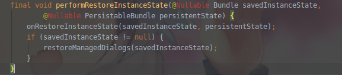
    4. callActivityOnPostCreate与上述同理

* Activity的创建过程 --ActivityThread.handleResumeActivity
    ```java
        @Override
        public void handleResumeActivity(IBinder token, boolean finalStateRequest, boolean isForward, String reason) {
            ...
            // 获取Activity, 准备调用Activity的onResume将数据更新到ActivityClientRecord
            final ActivityClientRecord r = performResumeActivity(token, finalStateRequest, reason);
            ...
            final Activity a = r.activity;
            ...
            // 标记启动Activity的, 用于判断Activity是否具有返回值
            boolean willBeVisible = !a.mStartedActivity;
            if (!willBeVisible) {
                try {
                    willBeVisible = ActivityTaskManager.getService().willActivityBeVisible(
                            a.getActivityToken());
                } catch (RemoteException e) {
                    throw e.rethrowFromSystemServer();
                }
            }
             //mFinished标记Activity有没有结束，而r.window一开始activity并未赋值给ActivityClientRecord，所以这里为null
            if (r.window == null && !a.mFinished && willBeVisible) {
                r.window = r.activity.getWindow();
                View decor = r.window.getDecorView();
                decor.setVisibility(View.INVISIBLE);
                ViewManager wm = a.getWindowManager();
                WindowManager.LayoutParams l = r.window.getAttributes();
                a.mDecor = decor;
                l.type = WindowManager.LayoutParams.TYPE_BASE_APPLICATION;
                l.softInputMode |= forwardBit;
                ...
                if (a.mVisibleFromClient) {
                    if (!a.mWindowAdded) {
                        a.mWindowAdded = true;
                        wm.addView(decor, l);
                    } else {
                        a.onWindowAttributesChanged(l);
                    }
                }
            }
            ...
            if (!r.activity.mFinished && willBeVisible && r.activity.mDecor != null && !r.hideForNow) {
                //标记当前的Activity有没有设置新的配置参数
                if (r.newConfig != null) {
                    performConfigurationChangedForActivity(r, r.newConfig);
                    ...
                    r.newConfig = null;
                }
                ...
                WindowManager.LayoutParams l = impl != null ? impl.mWindowAttributes : r.window.getAttributes();
                if ((l.softInputMode & WindowManager.LayoutParams.SOFT_INPUT_IS_FORWARD_NAVIGATION) != forwardBit) {
                    l.softInputMode = (l.softInputMode & (~WindowManager.LayoutParams.SOFT_INPUT_IS_FORWARD_NAVIGATION)) | forwardBit;
                    if (r.activity.mVisibleFromClient) {
                        ViewManager wm = a.getWindowManager();
                        View decor = r.window.getDecorView();
                        wm.updateViewLayout(decor, l);
                    }
                }
            }
            // 参数没有改变
            r.activity.mVisibleFromServer = true;
            mNumVisibleActivities++;
            if (r.activity.mVisibleFromClient) {
                r.activity.makeVisible();
            }
            ...
            Looper.myQueue().addIdleHandler(new Idler());
        }

        private void performConfigurationChangedForActivity(ActivityClientRecord r, Configuration newBaseConfig) {
            performConfigurationChangedForActivity(r, newBaseConfig, r.activity.getDisplayId(), false);
        }

        private Configuration performConfigurationChangedForActivity(ActivityClientRecord r,
            Configuration newBaseConfig, int displayId, boolean movedToDifferentDisplay) {
            r.tmpConfig.setTo(newBaseConfig);
            if (r.overrideConfig != null) {
                r.tmpConfig.updateFrom(r.overrideConfig);
            }
            final Configuration reportedConfig = performActivityConfigurationChanged(r.activity, r.tmpConfig, r.overrideConfig, displayId, movedToDifferentDisplay);
            freeTextLayoutCachesIfNeeded(r.activity.mCurrentConfig.diff(r.tmpConfig));
            return reportedConfig;
        }
    ```
    1. handleResumeActivity开始就调用了performResumeActivity获取ActivityClientRecord
        ```java
        @VisibleForTesting
        public ActivityClientRecord performResumeActivity(IBinder token, boolean finalStateRequest, String reason) {
            final ActivityClientRecord r = mActivities.get(token);
            ...
            if (finalStateRequest) {
            r.hideForNow = false;
            r.activity.mStartedActivity = false;
            }
            try {
                r.activity.onStateNotSaved();
                r.activity.mFragments.noteStateNotSaved();
                checkAndBlockForNetworkAccess();
                if (r.pendingIntents != null) {
                    deliverNewIntents(r, r.pendingIntents);
                    r.pendingIntents = null;
                }
                if (r.pendingResults != null) {
                    deliverResults(r, r.pendingResults, reason);
                    r.pendingResults = null;
                }

                //Activity调用onResume
                r.activity.performResume(r.startsNotResumed, reason);

                r.state = null;
                r.persistentState = null;
                r.setState(ON_RESUME);

                reportTopResumedActivityChanged(r, r.isTopResumedActivity, "topWhenResuming");
            } catch (Exception e) {
                if (!mInstrumentation.onException(r.activity, e)) {
                    throw new RuntimeException("Unable to resume activity "  + r.intent.getComponent().toShortString() + ": " + e.toString(), e);
                }
            }
            return r;
        }
        ```
* 至此, Activity被启动起来, 视图(DecorView)也被创建(Window)管理(WindowManager)起来了

## 总结
* ViewManager接口定义了一组规则，也就是add、update、remove的操作View接口。ViewGroup实现了该接口
* WindowManager的实现类是WindowManagerImpl，而它则是通过WindowManagerGlobal代理实现。WindowManager用来在应用与Window之间的接口、窗口顺序、消息等的管理

## 参考
* [简书](https://www.jianshu.com/p/6afb0c17df43)