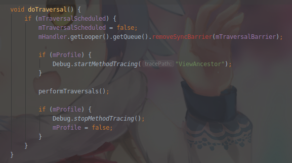

# 关于ViewRootImpl, View, WindowManager
* Activity实例化是通过获得ViewManager调用的addView
* ViewManager派生自WindowManager
* WindowManager的实现类是WindowManagerImpl
* WindowManagerImpl.addView是调用的WindowManagerGlobal.addView实现的
## 分析WindowManagerGlobal.addView
* 源代码
    ```java
        ...
        ViewRootImpl root;
        View panelParentView = null;
        synchronized (mLock) {
            ...
            root = new ViewRootImpl(view.getContext(), display);
            view.setLayoutParams(wparams);
            mViews.add(view);
            mRoots.add(root);
            mParams.add(wparams);
            try {
                root.setView(view, wparams, panelParentView, userId);
            } catch (RuntimeException e) {
                ...
            }
        }
    ```
* 可以看到ViewRootImpl是在这里进行实例化的, 并且最终调用的是ViewRootImpl的setView方法
## View通过ViewRootImpl来绘制 -- ViewRootImpl.setView

### ViewRootImpl
* ViewRootImpl是一个视图层次结构的顶部, 它实现了View与WindowManager之间所需要的协议, 作为WindowManagerGlobal中大部分的内部实现. 
* 在WindowManagerGlobal中实现方法中, 都会使用ViewRootImpl, 也就说WindowManagerGlobal方法最后还是调用到了ViewRootImpl. addView, removeView, update调用顺序: WindowManagerImpl -> WindowManagerGlobal -> ViewRootImpl

* 源代码
    ```java
        public void setView(View view, WindowManager.LayoutParams attrs, View panelParentView, int userId) {
            ...
            requestLayout();
            try {
                ...
                res = mWindowSession.addToDisplayAsUser(mWindow, mSeq, mWindowAttributes, getHostVisibility(), mDisplay.getDisplayId(), userId, mTmpFrame, mAttachInfo.mContentInsets, mAttachInfo.mStableInsets, mAttachInfo.mDisplayCutout, inputChannel, mTempInsets, mTempControls);
                    ...
                } 
        }
    ```
    1. setView中首先会调用requestLayout, 表示View添加到Window之前, 先完成第一次layout布局过程, 以确保在收到任何系统事件后面重新布局. requestLayout最终会调用performTraversals方法来完成View的绘制
        * requestLayout源码
        ```java
            @Override
            public void requestLayout() {
                if (!mHandlingLayoutInLayoutRequest) {
                    checkThread();
                    mLayoutRequested = true;
                    scheduleTraversals();
                }
            }
        ```
        * checkThread源码. 在View绘制之前, 会首先判断是不是当前线程在绘制, 如果不是, 抛出异常. 一般在子线程操作UI都会调用到view.invalidate, 而View的重新绘制会触发ViewRootImpl的requestLayout, 这里会判断线程是否为UI线程
        ```java
            void checkThread() {
                if (mThread != Thread.currentThread()) {
                    throw new CalledFromWrongThreadException(
                            "Only the original thread that created a view hierarchy can touch its views.");
                }
            }
        ```
        * scheduleTraversals源码. scheduleTraversals会通过mChoreographer异步调用mTraversalRunnable
        ```java
            @UnsupportedAppUsage
            void scheduleTraversals() {
                if (!mTraversalScheduled) {
                    mTraversalScheduled = true;
                    mTraversalBarrier = mHandler.getLooper().getQueue().postSyncBarrier();
                    mChoreographer.postCallback(Choreographer.CALLBACK_TRAVERSAL, mTraversalRunnable, null);
                    notifyRendererOfFramePending();
                    pokeDrawLockIfNeeded();
                }
            }
        ```
        
        
        * 可以看到它最后调用的是doTraversal进行绘制, 这个方法的核心是
        ```java
            private void performTraversals() {
                ...
                performMeasure(childWidthMeasureSpec, childHeightMeasureSpec);
                ...
                performLayout(lp, mWidth, mHeight);
                ...
                performDraw();
                ...
            }
        ```
        * 这三个方法最终又调用的是下面这三个方法, 然后会开始触发测量绘制
            + mView.measure(childWidthMeasureSpec, childHeightMeasureSpec)
            
            + mView.layout(0, 0, mView.getMeasuredWidth(), mView.getMeasuredHeight());
            
            + mView.draw(canvas)
            
            
            
        * performTraversals方法会经过measure, layout和draw三个过程才能将一个View绘制出来, 所以View的绘制是ViewRootImpl完成的, 此外当手动调用invalidate, postInvalidate, requestInvalidate也会最终调用performTraversals, 来重新绘制View
        
    2. 然后setView会通过WindowSeesion最终完成Window的添加过程. mWindowSession的类型是IWindowSession, 它是一个Binder对象, 真正的实现类是Seesion, 也就是说这是一次IPC(进程间通信)过程, 远程调用了Session中的addToDisplayAsUser方法

## View与WindowManager联系
* WindowManager继承自ViewManager接口, 而ViewManager提供了增加, 删除, 更新View的方法. 当Activity的onCreate执行到setContentView后, view只是把结构添加保存到DecorView中, 此时DecorView还没有被绘制(没有触发view.measure, layout, draw).
* DecorView真正被绘制显示是在Activity.handleResumeActivity方法中, DecorView被添加到WindowManager的时候, 也就是调用wm.addView(decor, l), 而这个方法最终会调用到WindowManagerGlobal.addView, 在这里面会初始化ViewRootImpl, 调用ViewRootImpl.setView, 最后调用performTraversals来进行view的绘制(measure, layout, draw), 这个时候View才被真正绘制出来(因为绘制过程是异步的， 所以在onCreate, onStart中无法获取绘制信息, 在onResume中也不一定能获取)
* 想要获取绘制信息, 需要对其进行监听, 监听执行的方法在performTraversals函数内, 此时虽然还没有进行最后的绘制, 但是已经经过了measure和layout来进行计算大小和位置, 所以可以获得绘制信息
    
* 注: 更新UI需要在ViewRootImpl实例化完成后, 才会真正更新到Window上, 而在onCreate方法执行时, 还没有创建ViewRootImpl, 所以如果在这里开启子线程修改UI, 可能也不会报错, 因为ViewRootImpl可能还未创建出来, 所以不会调用绘制, 检查更新的线程.

## View与ViewRootImpl的关系
* View获取ViewRootImpl, getViewRootImpl
    ```java
        @UnsupportedAppUsage
        public ViewRootImpl getViewRootImpl() {
            if (mAttachInfo != null) {
                return mAttachInfo.mViewRootImpl;
            }
            return null;
        }
    ```
* AttachInfo是View的内部静态类, 其实例化是在ViewRootImpl的构造函数里

* 而将AttachInfo设置给View是通过dispatchAttachedToWindow方法实现的

* 而dispatchAttachedToWindow是在ViewRootImpl的performTraversals方法中调用的

* 关于performTraversals, 上面已经提到过, 是在执行setView时调用的

## 总结
* ViewRootImpl是View和WindowManager的桥梁, 因为真正操作绘制View的是ViewRootImpl, View通过WindowManager间接调用ViewRootImpl
* ViewRootImpl未初始化创建完成时, 是可以通过子线程操作UI的
* ViewRootImpl在绘制UI的时候, 会先检查绘制线程是不是主线程, 才会继续绘制

## 参考
* [简书](https://www.jianshu.com/p/9da7bfe18374)