# 关于Dialog, Toast及WindowManager.LayoutParams, Token

## WindowManager.LayoutParams
* 源代码
```java
  public static class LayoutParams extends ViewGroup.LayoutParams implements Parcelable {
        //窗口的绝对XY位置，需要考虑gravity属性
        public int x;
        public int y;
        //在横纵方向上为相关的View预留多少扩展像素，如果是0则此view不能被拉伸，其他情况下扩展像素被widget均分
        public float horizontalWeight;
        public float verticalWeight;
        //窗口类型
        //有3种主要类型如下：
        //ApplicationWindows取值在FIRST_APPLICATION_WINDOW与LAST_APPLICATION_WINDOW之间，是常用的顶层应用程序窗口，须将token设置成Activity的token；
        //SubWindows取值在FIRST_SUB_WINDOW和LAST_SUB_WINDOW之间，与顶层窗口相关联，需将token设置成它所附着宿主窗口的token；
        //SystemWindows取值在FIRST_SYSTEM_WINDOW和LAST_SYSTEM_WINDOW之间，不能用于应用程序，使用时需要有特殊权限，它是特定的系统功能才能使用；
        public int type;

        //WindowType：开始应用程序窗口
        public static final int FIRST_APPLICATION_WINDOW = 1;
        //WindowType：所有程序窗口的base窗口，其他应用程序窗口都显示在它上面
        public static final int TYPE_BASE_APPLICATION   = 1;
        //WindowType：普通应用程序窗口，token必须设置为Activity的token来指定窗口属于谁
        public static final int TYPE_APPLICATION        = 2;
        //WindowType：应用程序启动时所显示的窗口，应用自己不要使用这种类型，它被系统用来显示一些信息，直到应用程序可以开启自己的窗口为止
        public static final int TYPE_APPLICATION_STARTING = 3;
        //WindowType：结束应用程序窗口
        public static final int LAST_APPLICATION_WINDOW = 99;

        //WindowType：SubWindows子窗口，子窗口的Z序和坐标空间都依赖于他们的宿主窗口
        public static final int FIRST_SUB_WINDOW        = 1000;
        //WindowType： 面板窗口，显示于宿主窗口的上层
        public static final int TYPE_APPLICATION_PANEL  = FIRST_SUB_WINDOW;
        //WindowType：媒体窗口（例如视频），显示于宿主窗口下层
        public static final int TYPE_APPLICATION_MEDIA  = FIRST_SUB_WINDOW+1;
        //WindowType：应用程序窗口的子面板，显示于所有面板窗口的上层
        public static final int TYPE_APPLICATION_SUB_PANEL = FIRST_SUB_WINDOW+2;
        //WindowType：对话框，类似于面板窗口，绘制类似于顶层窗口，而不是宿主的子窗口
        public static final int TYPE_APPLICATION_ATTACHED_DIALOG = FIRST_SUB_WINDOW+3;
        //WindowType：媒体信息，显示在媒体层和程序窗口之间，需要实现半透明效果
        public static final int TYPE_APPLICATION_MEDIA_OVERLAY  = FIRST_SUB_WINDOW+4;
        //WindowType：子窗口结束
        public static final int LAST_SUB_WINDOW         = 1999;

        //WindowType：系统窗口，非应用程序创建
        public static final int FIRST_SYSTEM_WINDOW     = 2000;
        //WindowType：状态栏，只能有一个状态栏，位于屏幕顶端，其他窗口都位于它下方
        public static final int TYPE_STATUS_BAR         = FIRST_SYSTEM_WINDOW;
        //WindowType：搜索栏，只能有一个搜索栏，位于屏幕上方
        public static final int TYPE_SEARCH_BAR         = FIRST_SYSTEM_WINDOW+1;
        //WindowType：电话窗口，它用于电话交互（特别是呼入），置于所有应用程序之上，状态栏之下
        public static final int TYPE_PHONE              = FIRST_SYSTEM_WINDOW+2;
        //WindowType：系统提示，出现在应用程序窗口之上
        public static final int TYPE_SYSTEM_ALERT       = FIRST_SYSTEM_WINDOW+3;
        //WindowType：锁屏窗口
        public static final int TYPE_KEYGUARD           = FIRST_SYSTEM_WINDOW+4;
        //WindowType：信息窗口，用于显示Toast
        public static final int TYPE_TOAST              = FIRST_SYSTEM_WINDOW+5;
        //WindowType：系统顶层窗口，显示在其他一切内容之上，此窗口不能获得输入焦点，否则影响锁屏
        public static final int TYPE_SYSTEM_OVERLAY     = FIRST_SYSTEM_WINDOW+6;
        //WindowType：电话优先，当锁屏时显示，此窗口不能获得输入焦点，否则影响锁屏
        public static final int TYPE_PRIORITY_PHONE     = FIRST_SYSTEM_WINDOW+7;
        //WindowType：系统对话框
        public static final int TYPE_SYSTEM_DIALOG      = FIRST_SYSTEM_WINDOW+8;
        //WindowType：锁屏时显示的对话框
        public static final int TYPE_KEYGUARD_DIALOG    = FIRST_SYSTEM_WINDOW+9;
        //WindowType：系统内部错误提示，显示于所有内容之上
        public static final int TYPE_SYSTEM_ERROR       = FIRST_SYSTEM_WINDOW+10;
        //WindowType：内部输入法窗口，显示于普通UI之上，应用程序可重新布局以免被此窗口覆盖
        public static final int TYPE_INPUT_METHOD       = FIRST_SYSTEM_WINDOW+11;
        //WindowType：内部输入法对话框，显示于当前输入法窗口之上
        public static final int TYPE_INPUT_METHOD_DIALOG= FIRST_SYSTEM_WINDOW+12;
        //WindowType：墙纸窗口
        public static final int TYPE_WALLPAPER          = FIRST_SYSTEM_WINDOW+13;
        //WindowType：状态栏的滑动面板
        public static final int TYPE_STATUS_BAR_PANEL   = FIRST_SYSTEM_WINDOW+14;
        //WindowType：安全系统覆盖窗口，这些窗户必须不带输入焦点，否则会干扰键盘
        public static final int TYPE_SECURE_SYSTEM_OVERLAY = FIRST_SYSTEM_WINDOW+15;
        //WindowType：拖放伪窗口，只有一个阻力层(最多)，它被放置在所有其他窗口上面
        public static final int TYPE_DRAG               = FIRST_SYSTEM_WINDOW+16;
        //WindowType：状态栏下拉面板
        public static final int TYPE_STATUS_BAR_SUB_PANEL = FIRST_SYSTEM_WINDOW+17;
        //WindowType：鼠标指针
        public static final int TYPE_POINTER = FIRST_SYSTEM_WINDOW+18;
        //WindowType：导航栏(有别于状态栏时)
        public static final int TYPE_NAVIGATION_BAR = FIRST_SYSTEM_WINDOW+19;
        //WindowType：音量级别的覆盖对话框，显示当用户更改系统音量大小
        public static final int TYPE_VOLUME_OVERLAY = FIRST_SYSTEM_WINDOW+20;
        //WindowType：起机进度框，在一切之上
        public static final int TYPE_BOOT_PROGRESS = FIRST_SYSTEM_WINDOW+21;
        //WindowType：假窗，消费导航栏隐藏时触摸事件
        public static final int TYPE_HIDDEN_NAV_CONSUMER = FIRST_SYSTEM_WINDOW+22;
        //WindowType：梦想(屏保)窗口，略高于键盘
        public static final int TYPE_DREAM = FIRST_SYSTEM_WINDOW+23;
        //WindowType：导航栏面板(不同于状态栏的导航栏)
        public static final int TYPE_NAVIGATION_BAR_PANEL = FIRST_SYSTEM_WINDOW+24;
        //WindowType：universe背后真正的窗户
        public static final int TYPE_UNIVERSE_BACKGROUND = FIRST_SYSTEM_WINDOW+25;
        //WindowType：显示窗口覆盖，用于模拟辅助显示设备
        public static final int TYPE_DISPLAY_OVERLAY = FIRST_SYSTEM_WINDOW+26;
        //WindowType：放大窗口覆盖，用于突出显示的放大部分可访问性放大时启用
        public static final int TYPE_MAGNIFICATION_OVERLAY = FIRST_SYSTEM_WINDOW+27;
        //WindowType：......
        public static final int TYPE_KEYGUARD_SCRIM           = FIRST_SYSTEM_WINDOW+29;
        public static final int TYPE_PRIVATE_PRESENTATION = FIRST_SYSTEM_WINDOW+30;
        public static final int TYPE_VOICE_INTERACTION = FIRST_SYSTEM_WINDOW+31;
        public static final int TYPE_ACCESSIBILITY_OVERLAY = FIRST_SYSTEM_WINDOW+32;
        //WindowType：系统窗口结束
        public static final int LAST_SYSTEM_WINDOW      = 2999;

        //MemoryType：窗口缓冲位于主内存
        public static final int MEMORY_TYPE_NORMAL = 0;
        //MemoryType：窗口缓冲位于可以被DMA访问，或者硬件加速的内存区域
        public static final int MEMORY_TYPE_HARDWARE = 1;
        //MemoryType：窗口缓冲位于可被图形加速器访问的区域
        public static final int MEMORY_TYPE_GPU = 2;
        //MemoryType：窗口缓冲不拥有自己的缓冲区，不能被锁定，缓冲区由本地方法提供
        public static final int MEMORY_TYPE_PUSH_BUFFERS = 3;

        //指出窗口所使用的内存缓冲类型，默认为NORMAL 
        public int memoryType;

        //Flag：当该window对用户可见的时候，允许锁屏
        public static final int FLAG_ALLOW_LOCK_WHILE_SCREEN_ON     = 0x00000001;
        //Flag：让该window后所有的东西都成暗淡
        public static final int FLAG_DIM_BEHIND        = 0x00000002;
        //Flag：让该window后所有东西都模糊（4.0以上已经放弃这种毛玻璃效果）
        public static final int FLAG_BLUR_BEHIND        = 0x00000004;
        //Flag：让window不能获得焦点，这样用户快就不能向该window发送按键事
        public static final int FLAG_NOT_FOCUSABLE      = 0x00000008;
        //Flag：让该window不接受触摸屏事件
        public static final int FLAG_NOT_TOUCHABLE      = 0x00000010;
        //Flag：即使在该window在可获得焦点情况下，依旧把该window之外的任何event发送到该window之后的其他window
        public static final int FLAG_NOT_TOUCH_MODAL    = 0x00000020;
        //Flag：当手机处于睡眠状态时，如果屏幕被按下，那么该window将第一个收到
        public static final int FLAG_TOUCHABLE_WHEN_WAKING = 0x00000040;
        //Flag：当该window对用户可见时，让设备屏幕处于高亮（bright）状态
        public static final int FLAG_KEEP_SCREEN_ON     = 0x00000080;
        //Flag：让window占满整个手机屏幕，不留任何边界
        public static final int FLAG_LAYOUT_IN_SCREEN   = 0x00000100;
        //Flag：window大小不再不受手机屏幕大小限制，即window可能超出屏幕之外
        public static final int FLAG_LAYOUT_NO_LIMITS   = 0x00000200;
        //Flag：window全屏显示
        public static final int FLAG_FULLSCREEN      = 0x00000400;
        //Flag：恢复window非全屏显示
        public static final int FLAG_FORCE_NOT_FULLSCREEN   = 0x00000800;
        //Flag：开启抖动（dithering）
        public static final int FLAG_DITHER             = 0x00001000;
        //Flag：当该window在进行显示的时候，不允许截屏
        public static final int FLAG_SECURE             = 0x00002000;
        //Flag：一个特殊模式的布局参数用于执行扩展表面合成时到屏幕上
        public static final int FLAG_SCALED             = 0x00004000;
        //Flag：用于windows时,经常会使用屏幕用户持有反对他们的脸,它将积极过滤事件流,以防止意外按在这种情况下,可能不需要为特定的窗口,在检测到这样一个事件流时,应用程序将接收取消运动事件表明,这样应用程序可以处理这相应地采取任何行动的事件,直到手指释放
        public static final int FLAG_IGNORE_CHEEK_PRESSES    = 0x00008000;
        //Flag：一个特殊的选项只用于结合FLAG_LAYOUT_IN_SC
        public static final int FLAG_LAYOUT_INSET_DECOR = 0x00010000;
        //Flag：转化的状态FLAG_NOT_FOCUSABLE对这个窗口当前如何进行交互的方法
        public static final int FLAG_ALT_FOCUSABLE_IM = 0x00020000;
        //Flag：如果你设置了该flag,那么在你FLAG_NOT_TOUNCH_MODAL的情况下，即使触摸屏事件发送在该window之外，其事件被发送到了后面的window,那么该window仍然将以MotionEvent.ACTION_OUTSIDE形式收到该触摸屏事件
        public static final int FLAG_WATCH_OUTSIDE_TOUCH = 0x00040000;
        //Flag：当锁屏的时候，显示该window
        public static final int FLAG_SHOW_WHEN_LOCKED = 0x00080000;
        //Flag：在该window后显示系统的墙纸
        public static final int FLAG_SHOW_WALLPAPER = 0x00100000;
        //Flag：当window被显示的时候，系统将把它当做一个用户活动事件，以点亮手机屏幕
        public static final int FLAG_TURN_SCREEN_ON = 0x00200000;
        //Flag：消失键盘
        public static final int FLAG_DISMISS_KEYGUARD = 0x00400000;
        //Flag：当该window在可以接受触摸屏情况下，让因在该window之外，而发送到后面的window的触摸屏可以支持split touch
        public static final int FLAG_SPLIT_TOUCH = 0x00800000;
        //Flag：对该window进行硬件加速，该flag必须在Activity或Dialog的Content View之前进行设置
        public static final int FLAG_HARDWARE_ACCELERATED = 0x01000000;
        //Flag：让window占满整个手机屏幕，不留任何边界
        public static final int FLAG_LAYOUT_IN_OVERSCAN = 0x02000000;
        //Flag：请求一个半透明的状态栏背景以最小的系统提供保护
        public static final int FLAG_TRANSLUCENT_STATUS = 0x04000000;
        //Flag：请求一个半透明的导航栏背景以最小的系统提供保护
        public static final int FLAG_TRANSLUCENT_NAVIGATION = 0x08000000;
        //Flag：......
        public static final int FLAG_LOCAL_FOCUS_MODE = 0x10000000;
        public static final int FLAG_SLIPPERY = 0x20000000;
        public static final int FLAG_LAYOUT_ATTACHED_IN_DECOR = 0x40000000;
        public static final int FLAG_DRAWS_SYSTEM_BAR_BACKGROUNDS = 0x80000000;

        //行为选项标记
        public int flags;

        //PrivateFlags：......
        public static final int PRIVATE_FLAG_FAKE_HARDWARE_ACCELERATED = 0x00000001;
        public static final int PRIVATE_FLAG_FORCE_HARDWARE_ACCELERATED = 0x00000002;
        public static final int PRIVATE_FLAG_WANTS_OFFSET_NOTIFICATIONS = 0x00000004;
        public static final int PRIVATE_FLAG_SHOW_FOR_ALL_USERS = 0x00000010;
        public static final int PRIVATE_FLAG_NO_MOVE_ANIMATION = 0x00000040;
        public static final int PRIVATE_FLAG_COMPATIBLE_WINDOW = 0x00000080;
        public static final int PRIVATE_FLAG_SYSTEM_ERROR = 0x00000100;
        public static final int PRIVATE_FLAG_INHERIT_TRANSLUCENT_DECOR = 0x00000200;
        public static final int PRIVATE_FLAG_KEYGUARD = 0x00000400;
        public static final int PRIVATE_FLAG_DISABLE_WALLPAPER_TOUCH_EVENTS = 0x00000800;

        //私有的行为选项标记
        public int privateFlags;

        public static final int NEEDS_MENU_UNSET = 0;
        public static final int NEEDS_MENU_SET_TRUE = 1;
        public static final int NEEDS_MENU_SET_FALSE = 2;
        public int needsMenuKey = NEEDS_MENU_UNSET;

        public static boolean mayUseInputMethod(int flags) {
            ......
        }

        //SOFT_INPUT：用于描述软键盘显示规则的bite的mask
        public static final int SOFT_INPUT_MASK_STATE = 0x0f;
        //SOFT_INPUT：没有软键盘显示的约定规则
        public static final int SOFT_INPUT_STATE_UNSPECIFIED = 0;
        //SOFT_INPUT：可见性状态softInputMode，请不要改变软输入区域的状态
        public static final int SOFT_INPUT_STATE_UNCHANGED = 1;
        //SOFT_INPUT：用户导航（navigate）到你的窗口时隐藏软键盘
        public static final int SOFT_INPUT_STATE_HIDDEN = 2;
        //SOFT_INPUT：总是隐藏软键盘
        public static final int SOFT_INPUT_STATE_ALWAYS_HIDDEN = 3;
        //SOFT_INPUT：用户导航（navigate）到你的窗口时显示软键盘
        public static final int SOFT_INPUT_STATE_VISIBLE = 4;
        //SOFT_INPUT：总是显示软键盘
        public static final int SOFT_INPUT_STATE_ALWAYS_VISIBLE = 5;
        //SOFT_INPUT：显示软键盘时用于表示window调整方式的bite的mask
        public static final int SOFT_INPUT_MASK_ADJUST = 0xf0;
        //SOFT_INPUT：不指定显示软件盘时，window的调整方式
        public static final int SOFT_INPUT_ADJUST_UNSPECIFIED = 0x00;
        //SOFT_INPUT：当显示软键盘时，调整window内的控件大小以便显示软键盘
        public static final int SOFT_INPUT_ADJUST_RESIZE = 0x10;
        //SOFT_INPUT：当显示软键盘时，调整window的空白区域来显示软键盘，即使调整空白区域，软键盘还是有可能遮挡一些有内容区域，这时用户就只有退出软键盘才能看到这些被遮挡区域并进行
        public static final int SOFT_INPUT_ADJUST_PAN = 0x20;
        //SOFT_INPUT：当显示软键盘时，不调整window的布局
        public static final int SOFT_INPUT_ADJUST_NOTHING = 0x30;
        //SOFT_INPUT：用户导航（navigate）到了你的window
        public static final int SOFT_INPUT_IS_FORWARD_NAVIGATION = 0x100;

        //软输入法模式选项
        public int softInputMode;

        //窗口如何停靠
        public int gravity;
        //水平边距，容器与widget之间的距离，占容器宽度的百分率
        public float horizontalMargin;
        //纵向边距
        public float verticalMargin;
        //积极的insets绘图表面和窗口之间的内容
        public final Rect surfaceInsets = new Rect();
        //期望的位图格式，默认为不透明，参考android.graphics.PixelFormat
        public int format;
        //窗口所使用的动画设置，它必须是一个系统资源而不是应用程序资源，因为窗口管理器不能访问应用程序
        public int windowAnimations;
        //整个窗口的半透明值，1.0表示不透明，0.0表示全透明
        public float alpha = 1.0f;
        //当FLAG_DIM_BEHIND设置后生效，该变量指示后面的窗口变暗的程度，1.0表示完全不透明，0.0表示没有变暗
        public float dimAmount = 1.0f;

        public static final float BRIGHTNESS_OVERRIDE_NONE = -1.0f;
        public static final float BRIGHTNESS_OVERRIDE_OFF = 0.0f;
        public static final float BRIGHTNESS_OVERRIDE_FULL = 1.0f;
        public float screenBrightness = BRIGHTNESS_OVERRIDE_NONE;
        //用来覆盖用户设置的屏幕亮度，表示应用用户设置的屏幕亮度，从0到1调整亮度从暗到最亮发生变化
        public float buttonBrightness = BRIGHTNESS_OVERRIDE_NONE;

        public static final int ROTATION_ANIMATION_ROTATE = 0;
        public static final int ROTATION_ANIMATION_CROSSFADE = 1;
        public static final int ROTATION_ANIMATION_JUMPCUT = 2;
        //定义出入境动画在这个窗口旋转设备时使用
        public int rotationAnimation = ROTATION_ANIMATION_ROTATE;

        //窗口的标示符
        public IBinder token = null;
        //此窗口所在的包名
        public String packageName = null;
        //屏幕方向
        public int screenOrientation = ActivityInfo.SCREEN_ORIENTATION_UNSPECIFIED;
        //首选的刷新率的窗口
        public float preferredRefreshRate;
        //控制status bar是否显示
        public int systemUiVisibility;
        //ui能见度所请求的视图层次结构
        public int subtreeSystemUiVisibility;
        //得到关于系统ui能见度变化的回调
        public boolean hasSystemUiListeners;

        public static final int INPUT_FEATURE_DISABLE_POINTER_GESTURES = 0x00000001;
        public static final int INPUT_FEATURE_NO_INPUT_CHANNEL = 0x00000002;
        public static final int INPUT_FEATURE_DISABLE_USER_ACTIVITY = 0x00000004;
        public int inputFeatures;
        public long userActivityTimeout = -1;

        ......
        public final int copyFrom(LayoutParams o) {
            ......
        }

        ......
        public void scale(float scale) {
            ......
        }

        ......
    }
```
* WindowManager.LayoutParams上有三种窗口类型type
    1. 应用程序窗口: type的值在FIRST_APPLICATION_WINDOW和LAST_APPLICATION_WINDOW之间, 须将token设置成Activity的token(例如Activity窗口, Dialog)
    2. 子窗口: type值在FIRST_SUB_WINDOW和LAST_SUB_WINDOW之间, SubWindows与顶层窗口相关联, 需将token设置成它所附着宿主窗口的token
    3. 系统窗口: type值在FIRST_SYSTEM_WINDOW和LAST_SYSTEM_WINDOW之间, SystemWindows不能用于应用程序, 使用时需要有特殊权限, 它是特定的系统功能才能使用(例如Toast, 输入法)

    ### token
    ***在应用程序窗口中, token是用来标识Activity的, 一个Activity就对应一个token令牌, 而在子窗口中, 某个子窗口想要依附在对应的宿主窗口上设置要将token设置为 对应宿主窗口的token***
    1. token是用来表示窗口的一个令牌, 只有符合条件的token才能被WMS通过添加到应用上
        *  token的传递过程
            1. 对于Activity里面的token, 它的创建是从AMS启动Activity开始的, 之后保存在ActivityRecord.appToken中. 而对于Activity中的token绑定到对应Window上是通过Activity的attach方法完成的
            
            
            2. 追踪token, 可以看到最后是传递到window.setWindowManager中
            
            3. 在setWindowManager中, appToken赋值到Window上, 并为当前Window创建WindowManager
            4. Activity通过WindowManager添加DecorView, 最终会调用WindowManagerGlobal.addView方法
            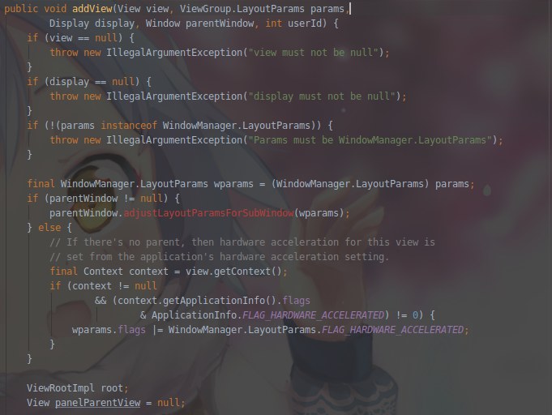
            5. parentWindow.adjustLayoutParamsForSubWindow(wparams)方法里面的重要一步就是给token设置值, 不过设置之前需要判断parentWindow是否为null
                * 如果是应用程序窗口的话, 这个paranetWindow就是activity的window
                * 如果是子窗口的话, 这个parentWindow就是activity的window
                * 如果是系统窗口的话, 这个parentWindow就是null
            6. 这个parentWindow则是在创建WindowManagerImpl的时候被赋值的
            
            
            7. Window.adjustLayoutParamsForSubWindow方法会通过wp.type来判断当前窗口的类型, 如果是子窗口类型, 则wp.token = decor.getWindowToken(), 这里赋值的是父窗口的W对象. 如果是应用程序窗口, 则走分支,  一般应用程序窗口的话, mContainer为null, 也就是mAppToken, 就是Activity的mToken对象.获取Token后就保存在了LayoutParams里面.
            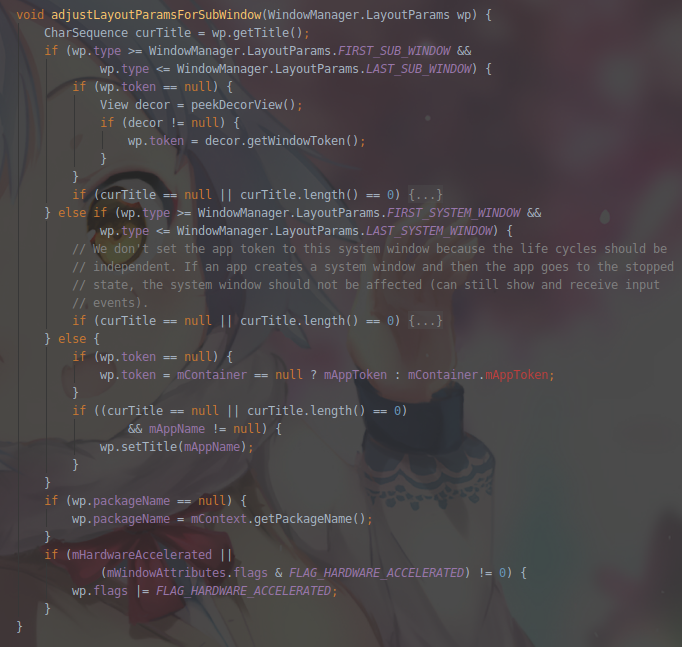
            8. 然后将设置完的参数传递给ViewRootImpl
            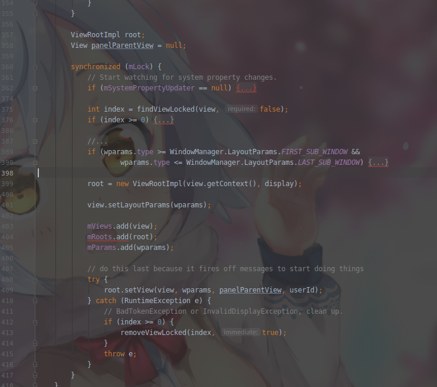
            9. 然后在ViewRootImpl中, 会调用setView方法, 将参数传递下去
            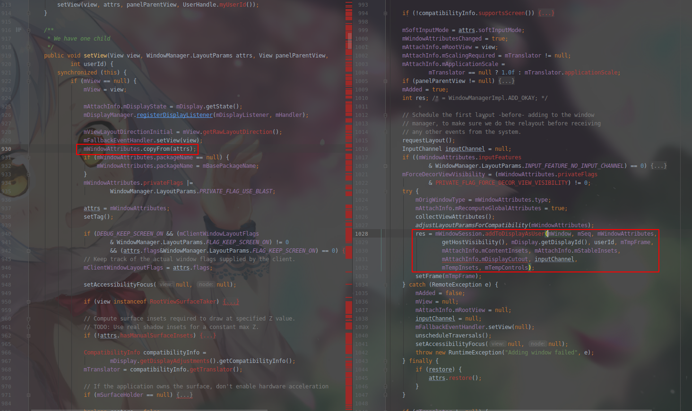
            10. 然后会将参数传递到mWindowSession.addToDisplayAsUser中, 这里是在通过Binder的方式与WMS通讯
            
            11. session然后调用了WMS的addWindow方法, 这里面做了很多判断, 显示判断对应的权限, 不满足直接return到ViewRootImpl的setView, 满足权限, 则用mWindowMap匹配params.token值, 如果不满足, 返回相应错误到ViewRootImpl去处理, 都没问题则开始添加Window. ViewRootImpl的setView方法则对返回值进行报错处理.
            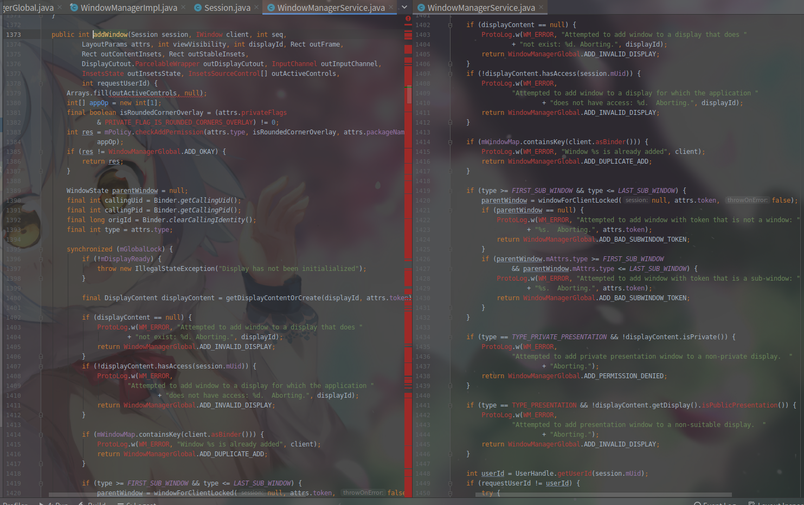
            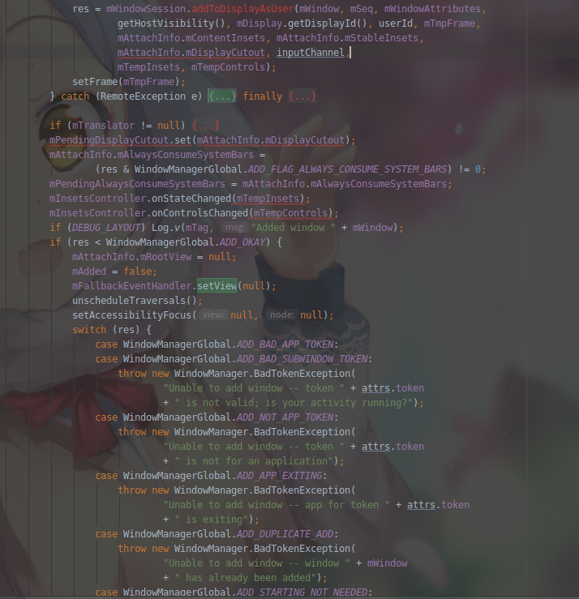
            12. 所以, ViewRootImpl会根据WMS检测token的返回情况, 去做是否要报错的处理

    ### ViewRootImpl和View的mAttachInfo
    ***token是绑定在Window上(上面所写的过程, 通过setWindowManager方法绑定), 而对于View, 它所有的绑定信息都是储存在一个静态内部类AttachInfo中***
    1. 在ViewRootImpl的构造函数中, 会创建AttachInfo的实例, 这里传递了mWindow和mWindowSession, 这个mWindow可以拿到token, 通过mWindow.asBinder, 它是WMS的回调接口
    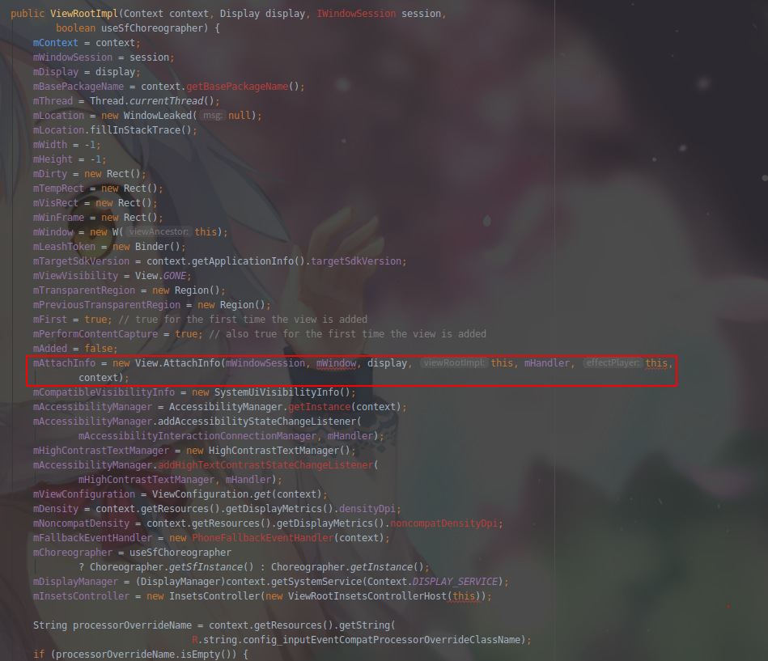
    2. 在AttachInfo的构造函数中, 会绑定各种状态信息
    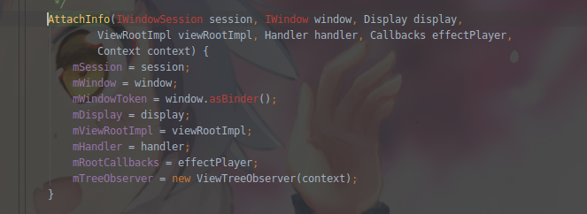
        * mWindow: WMS的回调应用程序的Binder接口
        * mSession: 访问WMS的Binder接口
        * mWindowToken: 它是window.asBinder(), window是W对象, 通过在ViewRootImpl的构造函数中new W()创建的.mWindowToken也是WMS和应用程序交互的Binder接口, 获取到以后可以通过view.getWindowToken()获取
    3. AttachInfo绑定给View, 前面分析过, 在调用setView时, 会异步调用performTraversals来进行计算大小, 定位和绘制. 然后会调用View的dispatchAttachedToWindow方法传递AttachInfo
    
    4. 当是View时, 会直接保存信息. 当是ViewGroup, 会先调用父类方法保存然后遍历子元素调用该方法
    
    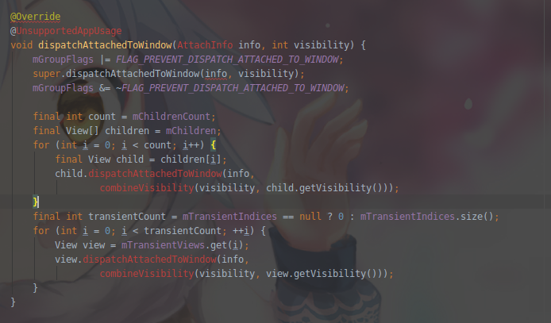

## Dialog

### Dialog创建
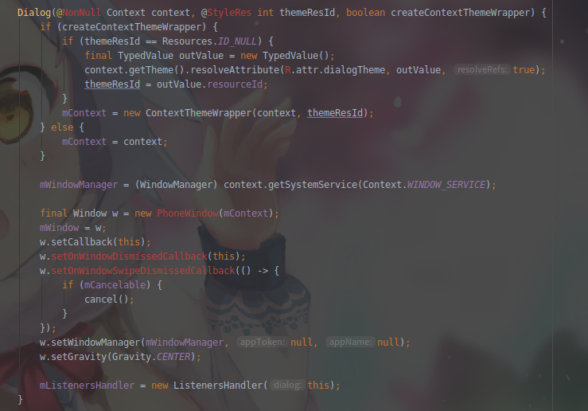
* Dialog创建需要传入Activity, 因为Dialog创建过程与Activity类似, 需要ContextThemeWrapper, 但是Dialog并没有继承ContextThemeWrapper, 所以需要搭配继承了ContextThemeWrapper的Activity使用
* Dialog会通过Context(Activity)获得WindowManager, 可以看到这里实际上就是返回的Activity的WindowManager
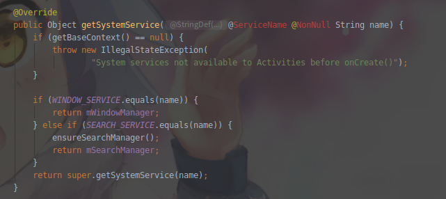
* 然后Dialog创建了一个PhoneWindow并设置了回调, 这也是Dialog能受到按键事件的原因, 这和创建Dialog的Activity不是同一个Window(是同一个WindowManager)
* 调用setWindowManager设置WindowManager, 这里的token是null

* Dialog显示是需要token, 它是用的Activity的token, 代码分析如下
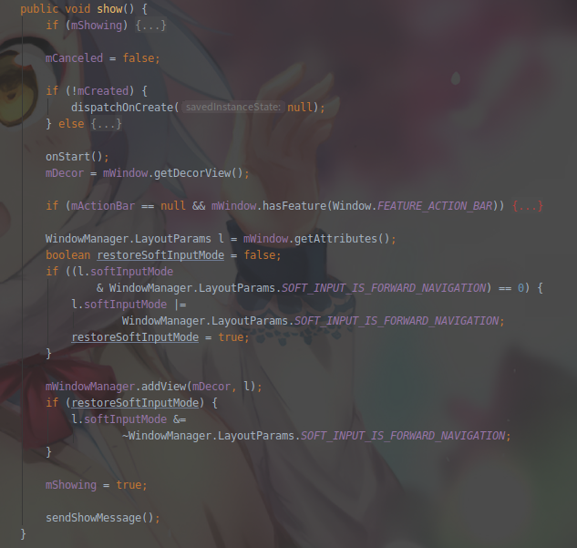
* show方法中会首先通过dispatchOnCreate方法调用Dialog的onCreate方法

* onCreate在Dialog中的实现是空, 所以我们研究一下它的子类(AlertDialog)

* 因为Dialog和Activity类似, 所以它也调用了setContentView, 最终会调用到PhoneWindow的setContentView
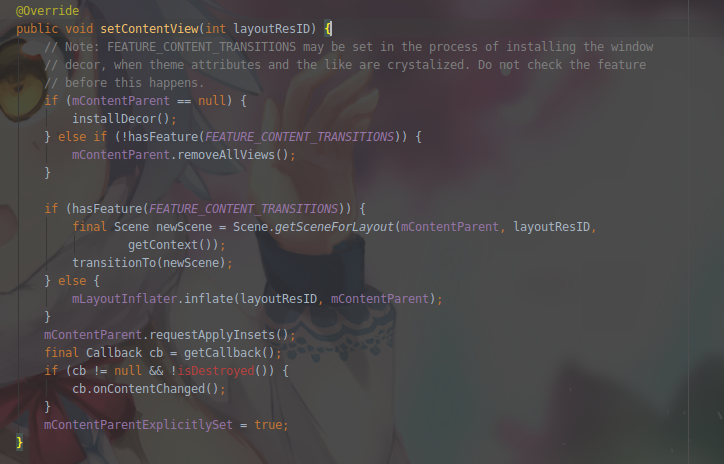
* 然后会在installDecor中创建DecorView, 创建完成后, 返回show方法, mDecor = mWindow.getDecorView()会获取刚才创建的DecorView
* 然后通过WindowManager.LayoutParams l = mWindow.getAttributes()获取布局参数

* mWindowAttributes是一个默认创建

* 然后就到mWindowManager.addView(mDecor, l), 这里的mWindowManager是创建Dialog的Activity的WindowManager, 这个之前也分析过, 会调用WindowManagerGlobal的addView, 然后实例化并调用ViewRootImpl的setView方法
* 在调用WindowManagerGlobal的addView之前, 它会applyDefaultToken, 这里就是在设置token为WindowManager的token

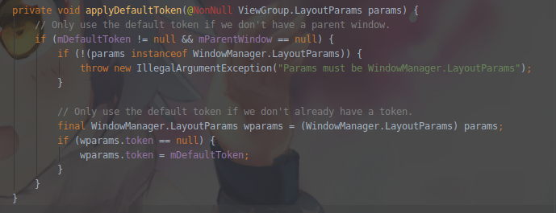
* 因为WindowManager是共用的Activity的token, 所以这里设置的是Activity的token
* 这也说明了, 在创建Dialog的时候, 上下文必须传递Activity, 不能使用getApplication()或者Service, 不然在ViewRootImpl中setView会找不到token

## Toast

* 创建Toast一般是调用其静态方法makeText
    ```java
    Toast.makeText(MainActivity.this, "Content", Toast.LENGTH_SHORT)
    ```
    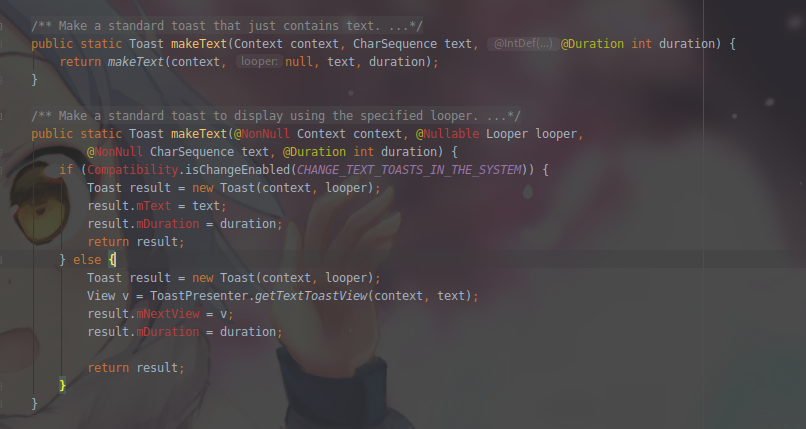
* 这里的Context就可以使用Application或Activity
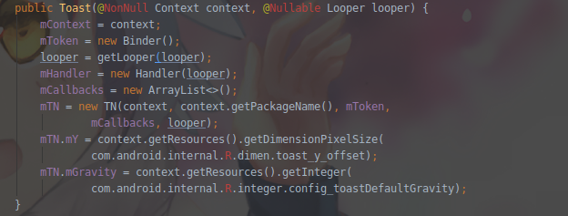
* 在这个构造方法里, 它创建了一个TN对象, TN是一个Binder对象, 是用来跨进程调用的, 里面封装了show, hide等方法  
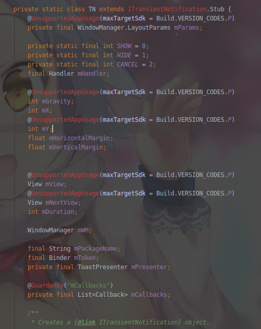
* Toast的show方法, 它会首先判断mNextView是否为空, 这个是在makeTest设置的, 然后通过getService拿到NotificationManagerService的访问接口, 通过enqueueToast方法将TN, 包信息以及设置时常发送到队列中


## 总结
* WindowManager.LayoutParams中有三种类型
* 对于Activity里面ActivityRecord的token, 它间接标识了一个Activity, 想要依附在Activity上需要将token设置成Activity的token, 接着传到WMS中判断后返回到ViewRootImpl去判断报错
* View的绑定信息通过它的静态内部类AttachInfo在ViewRootImpl中绑定
* Dialog会和Activity共用一个WindowManager, 它们两者的Window不相同, 一个Activity对应一个Window, 但是Window可能对应的是Dialog

## 参考
* [简书](https://www.jianshu.com/p/bac61386d9bf)