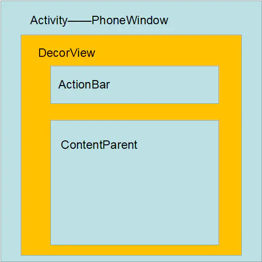

# 关于ViewRootImpl

## 前言
* ViewRootImpl不是一个View
* ViewRootImpl是用来管理View树的
* 关于View与Activity之间的关系, 如下图所示


## 关于ViewRootImpl和DecorView
* ViewRootImpl: 
    1. 是连接WindowManager和DecorView的纽带, View的三大流程都是通过ViewRootImpl来执行
    2. 在ActivityThread中, Activity创建完毕后, 会将DecorView加入到Window中, 同时创建ViewRootImpl对象, 并建立两者的关联
* DecorView:
    1. DecorView是Activity的顶层View, 它的内部是一个垂直布局的LineraLayout, 这LineraLayout包括上下两部分
        * 上半部分是标题栏
        * 下半部分是内容栏, 在Activity中设置的布局就是加载到这个地方
    2. DecorView本质上是一个FrameLayout, View层的事件都先经过DecorView, 然后才传递到具体的View

## ViewRootImpl源码分析

### 1. 实例化
* ViewRootImpl是在WIndowManagerGolobal类内实例化的, 主要代码如下
    ```java
    public void addView(View view, ViewGroup.LayoutParams params,Display display, Window parentWindow, int userId) {
        ...
        ViewRootImpl root;
        View panelParentView = null;
        synchronized (mLock) {
            ...
            root = new ViewRootImpl(view.getContext(), display);
            view.setLayoutParams(wparams);
            mViews.add(view);
            mRoots.add(root);
            mParams.add(wparams);
            ...
            root.setView(view, wparams, panelParentView, userId);
            ...
        }
        ...

    }
    ```
    **分析:**  
    1.  ViewRootImpl是在WindowManagerGlobal的addView方法内部完成构造的
    2. 构造完成后会将实例添加到mRoots中, mRoots是一个ArrayList
    3. 然后会将View等相关实例设置给ViewRootImpl

    **猜测:**  
    1. 每一个Activity下都有且只有一个管理ViewTree的ViewRootImpl
    2. 通过将View设置给ViewRootImpl来实现其对ViewTree的管理
