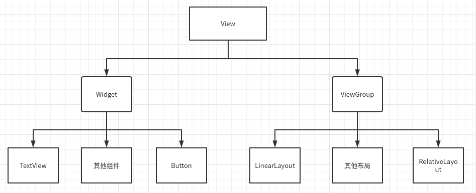
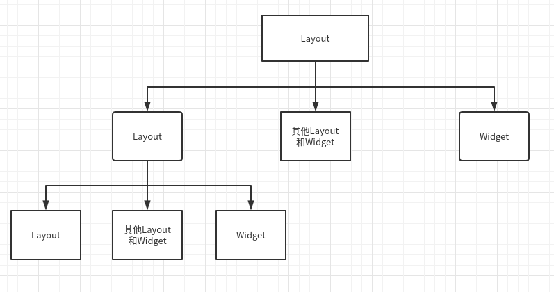

# 关于View和ViewGroup

## View
1. 在Android中, 一切可以显示的UI类都是View
2. View是用来负责绘图和事件处理的
3. 整个页面是由一颗View作为节点构成的树, 这也与布局文件是XML的结构相吻合
4. View的子类称为Widget(非ViewGroup的类)

### View的绘制流程
* View的绘制流程是从ViewRoot的performTraversals方法开始的. 它经过measure,layout和draw三个过程将一个View绘制出来, 其中measure用来测量View的宽和高, layout用来确定View在父容器中的位置. 而draw则负责将View绘制在屏幕上

## ViewGroup
1. ViewGroup是可以存放View的容器
2. ViewGroup派生自View, 故ViewGroup也可以存放ViewGroup
3. ViewGroup的子类称为Layout

## 关于结构
1. 从继承关系上来讲, 结构如下所示

2. 从逻辑上来讲, 结构如下所示
